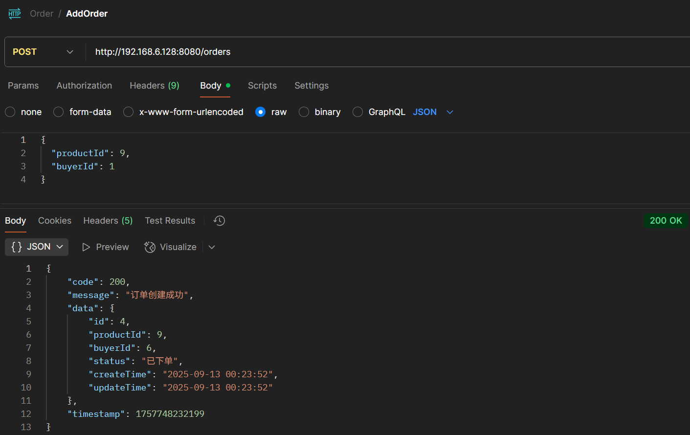
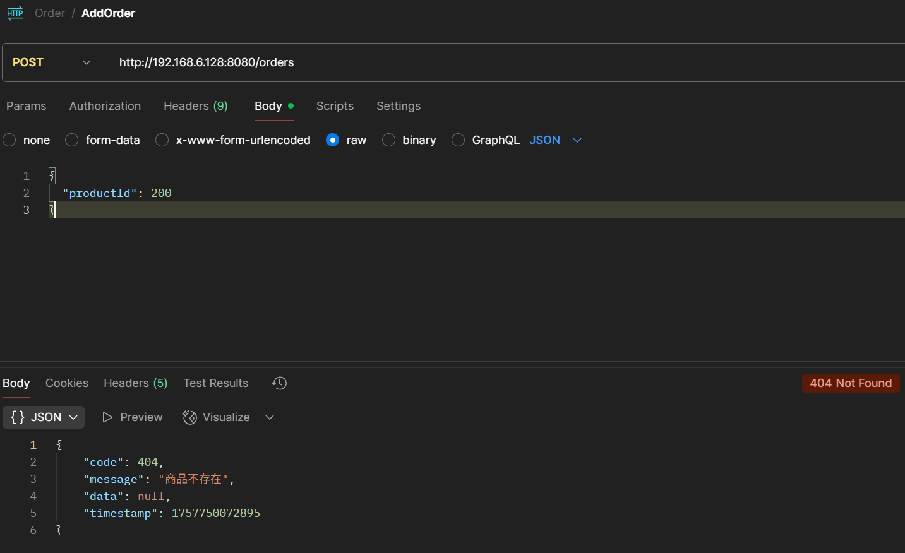
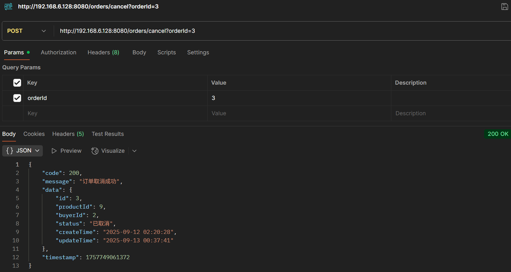
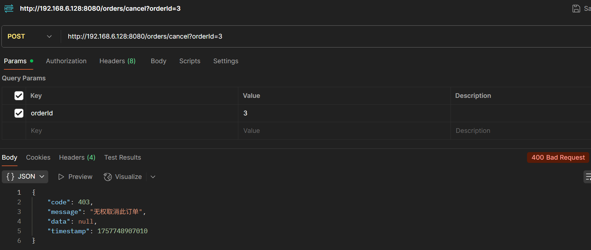
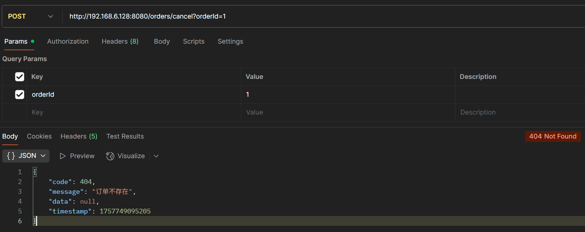
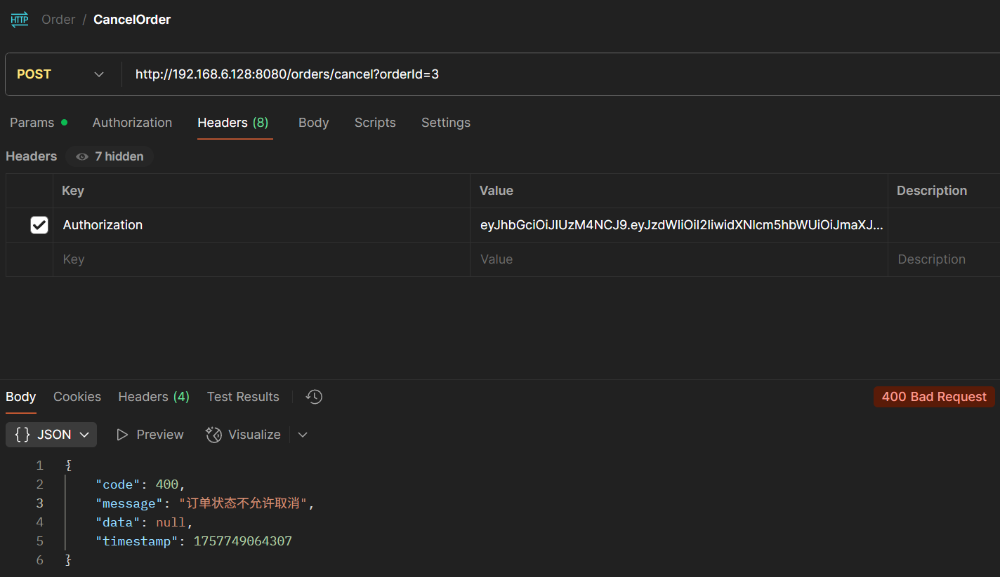
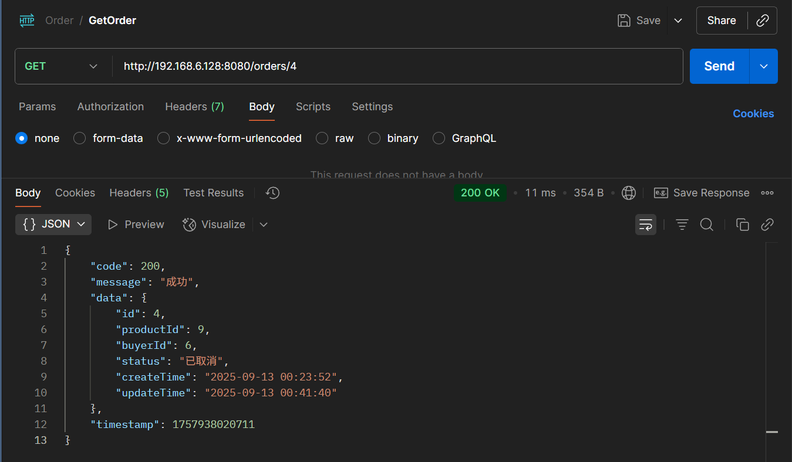
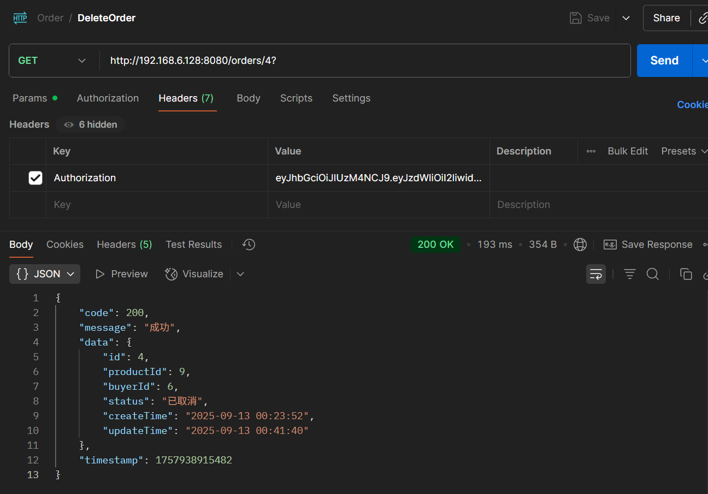
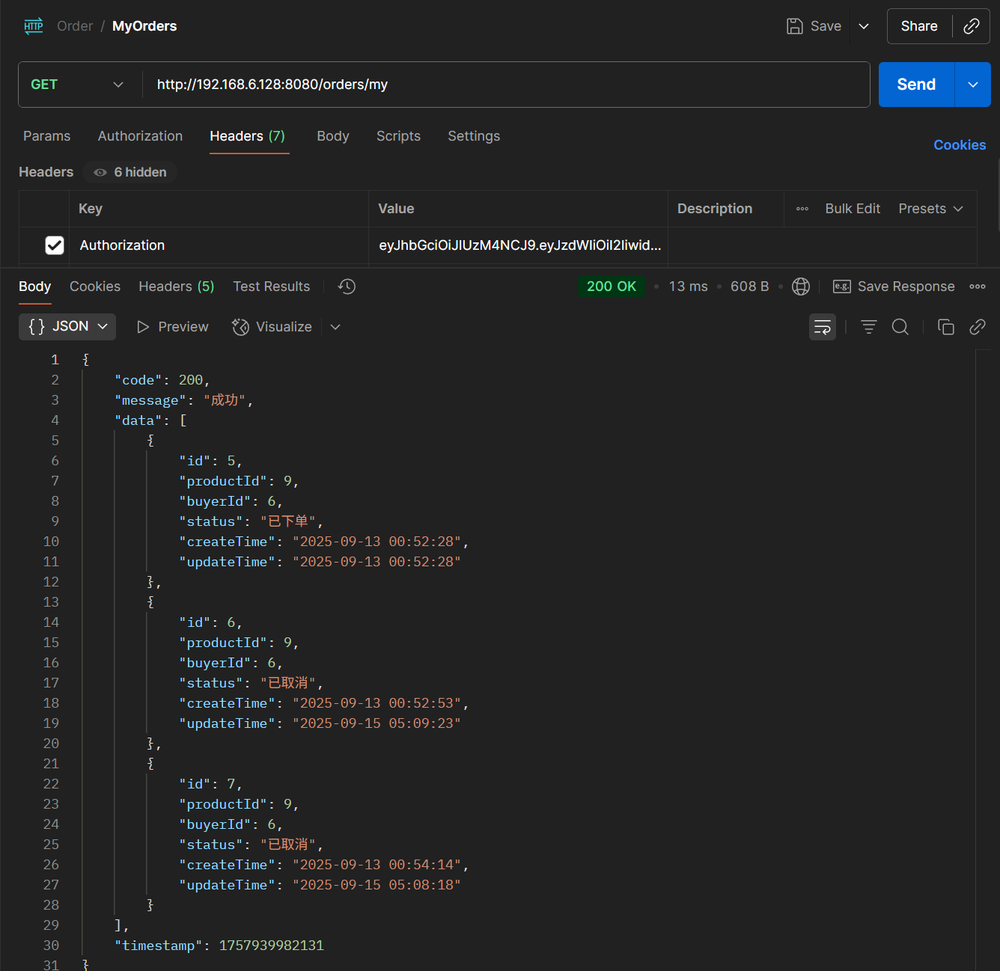

# Order API

# addOrder

###  创建订单

**请求方式：** POST

**网址:** http://192.168.6.128:8080/orders/add

**请求参数:**

| 字段名         | 类型     | 是否必填 | 说明      | 示例值              |
| ----------- | ------ | ---- | ---------------- |-|
| productId   | long   | 是    | 商品id      | 1            |


**请求示例(请求体):**

```
{
  "productId": 1,
}
```

**回应结构:**

```
{
    "code": 200,
    "message": "订单创建成功",
    "data": {
        "id": 4,
        "productId": 9,
        "buyerId": 6,
        "status": "已下单",
        "createTime": "2025-09-13 00:23:52",
        "updateTime": "2025-09-13 00:23:52"
    },
    "timestamp": 1757748232199
}
```
**PostMan测试结果:**



# CancelOrder

###  取消订单

**请求方式：** POST

**网址:** http://192.168.6.128:8080/orders/{orderId}/cancel

**请求参数:**

| 字段名         | 类型     | 是否必填 | 说明      | 示例值              |
| ----------- | ------ | ---- | ---------------- |-|
| orderid     | long   | 是    | 订单id      | 1            |

USER只能取消自己的订单，ADMIN可以取消所有订单

**请求示例(网址参数):**

http://192.168.6.128:8080/orders/4/cancel

**回应结构:**

```json
{
    "code": 200,
    "message": "订单取消成功",
    "data": {
        "id": 4,
        "productId": 9,
        "buyerId": 6,
        "status": "已取消",
        "createTime": "2025-09-13 00:23:52",
        "updateTime": "2025-09-13 00:41:40"
    },
    "timestamp": 1757749300162
}
```

**PostMan测试结果:**






# getOrder

### 获取订单信息

**请求方式：** GET

**网址:** http://192.168.6.128:8080/orders/{orderId}

**请求参数:**

| 字段名         | 类型     | 是否必填 | 说明      | 示例值              |
| ----------- | ------ | ---- | ---------------- |-|
| orderid     | long   | 是    | 订单id      | 1            |

**请求示例(网址参数):**

http://192.168.6.128:8080/orders/1

**回应结构:**

```json
{
    "code": 200,
    "message": "成功",
    "data": {
        "id": 4,
        "productId": 9,
        "buyerId": 6,
        "status": "已取消",
        "createTime": "2025-09-13 00:23:52",
        "updateTime": "2025-09-13 00:41:40"
    },
    "timestamp": 1757938020711
}
```

**PostMan测试结果:**



# deleteOrder

### 删除订单

**请求方式：** DELETE

**网址:** http://192.168.6.128:8080/orders/{orderId}

**请求参数:**

| 字段名         | 类型     | 是否必填 | 说明      | 示例值              |
| ----------- | ------ | ---- | ---------------- |-|
| orderid     | long   | 是    | 订单id      | 1            |

**请求示例(网址参数):**

http://192.168.6.128:8080/orders/1

**回应结构:**   

```json
{
    "code": 200,
    "message": "成功",
    "data": {
        "id": 4,
        "productId": 9,
        "buyerId": 6,
        "status": "已取消",
        "createTime": "2025-09-13 00:23:52",
        "updateTime": "2025-09-13 00:41:40"
    },
    "timestamp": 1757938915482
}
```

**PostMan测试结果:**




# getMyOrders

### 获取我的订单

**请求方式：** GET

**网址:** http://192.168.6.128:8080/orders/my

**请求参数:**

无

**请求示例(网址):**

http://192.168.6.128:8080/orders/my

**回应结构:**

```json
{
    "code": 200,
    "message": "成功",
    "data": [
        {
            "id": 5,
            "productId": 9,
            "buyerId": 6,
            "status": "已下单",
            "createTime": "2025-09-13 00:52:28",
            "updateTime": "2025-09-13 00:52:28"
        },
        {
            "id": 6,
            "productId": 9,
            "buyerId": 6,
            "status": "已取消",
            "createTime": "2025-09-13 00:52:53",
            "updateTime": "2025-09-15 05:09:23"
        },
        {
            "id": 7,
            "productId": 9,
            "buyerId": 6,
            "status": "已取消",
            "createTime": "2025-09-13 00:54:14",
            "updateTime": "2025-09-15 05:08:18"
        }
    ],
    "timestamp": 1757939982131
}
```

**PostMan测试结果:**

