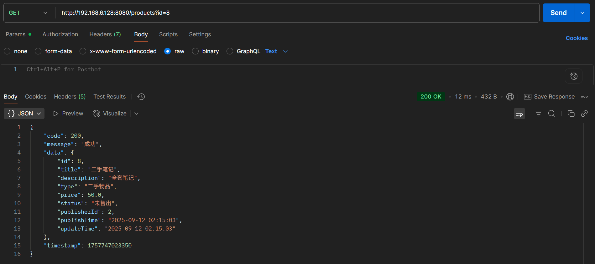
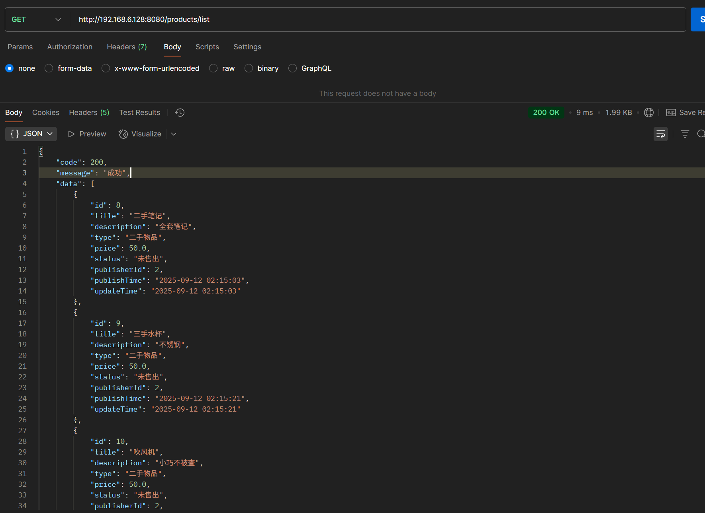
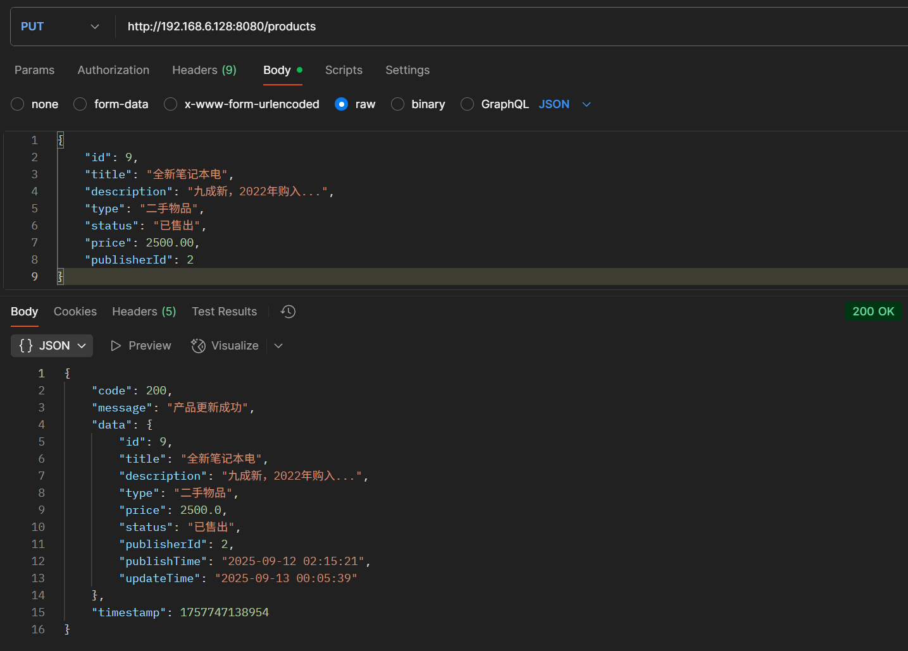
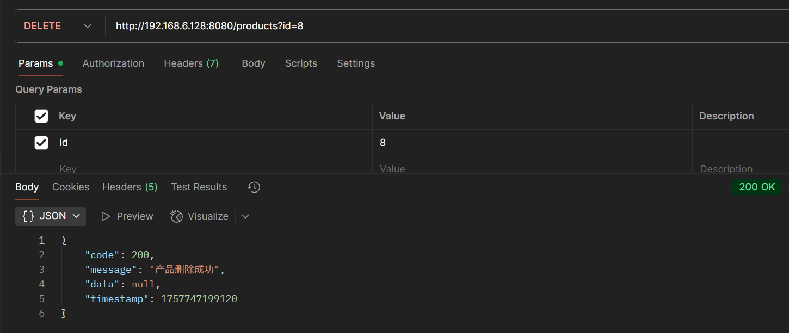
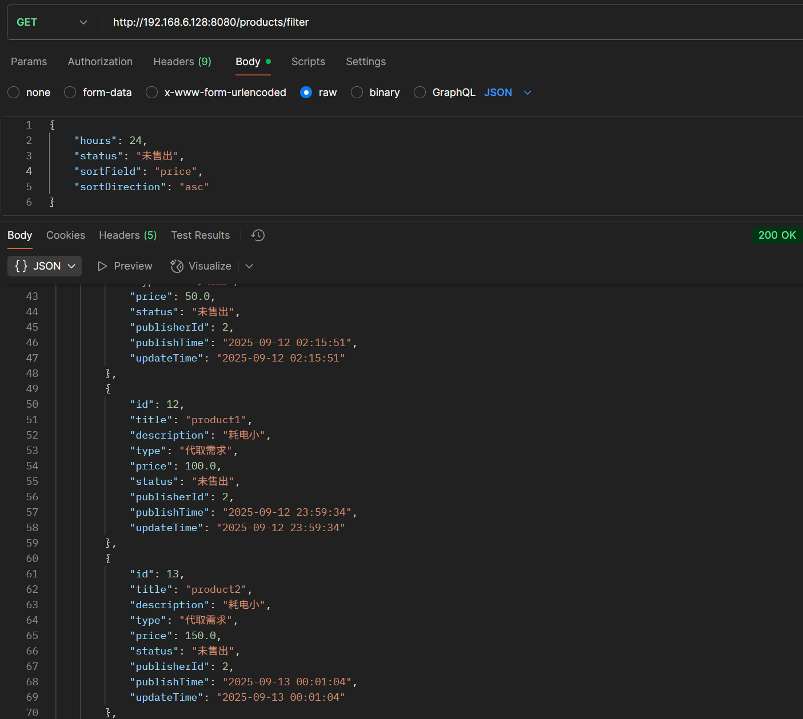

# product的文档

## getProduct

### 查询产品信息

**请求方式:** GET

**网址: http://192.168.6.128:8080/products**

**请求参数:**

| 字段名         | 类型     | 是否必填 | 说明      | 示例值              |
| ----------- | ------ | ---- | ---------------- |-|
| id          | number | 是    | 产品ID，唯一标识符 | 5                |

**请求示例(网址传参):**

    http://192.168.6.128:8080/products?id=5

**回应结构:**

```json
{
    "code": 200,
    "message": "成功",
    "data": {
        "id": 5,
        "title": "全新笔记本电",
        "description": "九成新，2022年购入...",
        "type": "二手物品",
        "price": 2500.0,
        "status": "已售出",
        "publisherId": null,
        "publishTime": null,
        "updateTime": null
    },
    "timestamp": 1757642675859
}
```

**Postman测试结果:**



## getProductList

### 查询产品列表 

**请求方式:** GET

**网址: http://192.168.6.128:8080/products/list**

**请求参数:**  

| 字段名         | 类型     | 是否必填 | 说明      | 示例值              |
| ----------- | ------ | ---- | ---------------- |-|
| pageNum          | number | 是    | | 5                |
| pageSize          | number | 是    |  | 5                |


**请求示例**

    http://192.168.6.128:8080/products/list

**回应结构:**

```
{
    "code": 200,
    "message": "成功",
    "data": [
        {
            "id": 4,
            "title": "全新笔记本电脑",
            "description": "九成新，2022年购入...",
            "type": "二手物品",
            "price": 2500.0,
            "status": "已售出",
            "publisherId": null,
            "publishTime": null,
            "updateTime": null
        },
        {
            "id": 5,
            "title": "全新笔记本电",
            "description": "九成新，2022年购入...",
            "type": "二手物品",
            "price": 2500.0,
            "status": "已售出",
            "publisherId": null,
            "publishTime": null,
            "updateTime": null
        },
        {
            "id": 6,
            "title": "二手笔记",
            "description": "全套笔记",
            "type": "二手物品",
            "price": 50.0,
            "status": "未售出",
            "publisherId": null,
            "publishTime": null,
            "updateTime": null
        }
    ],
    "timestamp": 1757642805586
}
```
**Postman测试结果:**




## addProduct

### 添加产品信息

**请求方式:** POST

**网址: http://192.168.6.128:8080/products**

**请求参数:**

| 字段名         | 类型     | 是否必填 | 说明      | 示例值              |
| ----------- | ------ | ---- | ------- | ---------------- |
| title       | string | 是    | 商品标题    | "二手笔记本电脑"        |
| description | string | 否    | 商品详细描述  | "九成新，2022年购入..." |
| type        | string | 是    | 商品类型    | "二手物品"/"代取需求"   |
| price       | number | 是    | 价格      | 2500.00          |
| publisherId | number | 是    | 发布者用户ID | 1                |


**请求示例:**
```
{
    "title": "二手笔记本电脑",
    "description": "九成新，2022年购入...",
    "type": "二手物品",
    "price": 2500.00,
    "publisherId": 1
}
```

**回应结构:**

```
{
  "code": 200,
    "message": "产品添加成功",
    "data": {
        "id": 16,
        "title": "product5",
        "description": "耗电小",
        "type": "代取需求",
        "price": 15000.0,
        "status": "未售出",
        "publisherId": 2,
        "publishTime": "2025-09-13 00:01:20",
        "updateTime": "2025-09-13 00:01:20"
    },
    "timestamp": 1757746880272
}
```
**Postman测试结果:**


## updateProduct

**请求方式:** PUT

**网址: http://192.168.6.128:8080/products**

**请求参数:**

| 字段名         | 类型     | 是否必填 | 说明      | 示例值              |
| ----------- | ------ | ---- | ---------------- |-|
| id          | number | 是    | 产品ID，唯一标识符 | 5                |
| title       | string | 否    | 商品标题    | "二手笔记本电脑"        |
| description | string | 否    | 商品详细描述  | "九成新，2022年购入..." |
| type        | string | 否    | 商品类型    | "二手物品"/"代取需求"   |
| price       | number | 否    | 价格      | 2500.00          |

**请求示例:**
```
{
    "id": 5,
    "title": "二手笔记本电脑",
    "description": "九成新，2022年购入...",
    "type": "二手物品",
    "price": 2500.00,
}
```

**回应结构:**

```
{
  "code": 200,       // 业务状态码（200表示成功，其他表示失败）
  "message": "操作成功", // 给开发者的提示信息
  "data": {
        "id": 9,
        "title": "全新笔记本电",
        "description": "九成新，2022年购入...",
        "type": "二手物品",
        "price": 2500.0,
        "status": "已售出",
        "publisherId": 2,
        "publishTime": "2025-09-12 02:15:21",
        "updateTime": "2025-09-13 00:05:39"
    },
    "timestamp": 1757747138954
}
```
**Postman测试结果:**



## deleteProduct

**请求方式:** DELETE

**网址: http://192.168.6.128:8080/products**

**请求参数:**

| 字段名         | 类型     | 是否必填 | 说明      | 示例值              |
| ----------- | ------ | ---- | ---------------- |-|
| id          | number | 是    | 产品ID，唯一标识符 | 5                |

**请求示例:**

    http://192.168.6.128:8080/products?id=5

**回应结构:**

```
{
    "code": 200,
    "message": "产品删除成功",
    "data": null,
    "timestamp": 1757747199120
}
```
**Postman测试结果:**



# filter

### 筛选器

**请求方式:** GET

**网址: http://192.168.6.128:8080/products/filter**

**请求参数:**

| 字段名         | 类型     | 是否必填 | 说明      | 示例值              |
| ----------- | ------ | ---- | ---------------- |-|
| type        | string | 否    | 商品类型    | "二手物品"/"代取需求"   |
| minPrice    | number | 否    | 最低价格    | 1000.00          |
| maxPrice    | number | 否    | 最高价格    | 5000.00          |
| hours       | number | 否    | 发布时间距离当前多少小时 | 24          |
| status      | string | 否    | 商品状态    | "未售出"/"已售出"   |
| sortField   | string | 否    | 排序字段    | "price"/"public_time"   |
| sortDirection| string | 否    | 排序方向    | "asc"/"desc"   |

**请求示例(请求体):**

```json
{
    "type": "二手物品",
    "minPrice": 1000.00,
    "maxPrice": 5000.00,
    "hours": 24,  
    "status": "未售出",
    "sortField": "price",
    "sortDirection": "asc"
}
```

**回应结构:**

```json
{
    "code": 200,
    "message": "成功",
    "data": [
        {
            "id": 13,
            "title": "product2",
            "description": "耗电小",
            "type": "代取需求",
            "price": 150.0,
            "status": "未售出",
            "publisherId": 2,
            "publishTime": "2025-09-13 00:01:04",
            "updateTime": "2025-09-13 00:01:04"
        },
        {
            "id": 14,
            "title": "product3",
            "description": "耗电小",
            "type": "代取需求",
            "price": 150.0,
            "status": "未售出",
            "publisherId": 2,
            "publishTime": "2025-09-13 00:01:09",
            "updateTime": "2025-09-13 00:01:09"
        },
        {
            "id": 15,
            "title": "product4",
            "description": "耗电小",
            "type": "代取需求",
            "price": 1500.0,
            "status": "未售出",
            "publisherId": 2,
            "publishTime": "2025-09-13 00:01:15",
            "updateTime": "2025-09-13 00:01:15"
        },
        {
            "id": 16,
            "title": "product5",
            "description": "耗电小",
            "type": "代取需求",
            "price": 15000.0,
            "status": "未售出",
            "publisherId": 2,
            "publishTime": "2025-09-13 00:01:20",
            "updateTime": "2025-09-13 00:01:20"
        }
    ],
    "timestamp": 1757746886434
}
```

**Postman测试结果:**

