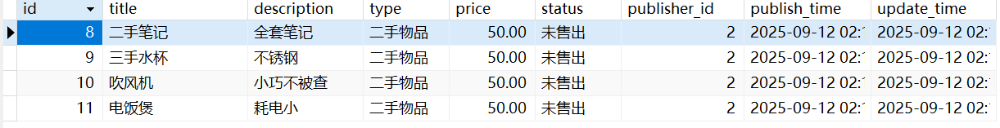

org.springframework.http.converter.HttpMessageNotReadableException: JSON parse error: Cannot deserialize value of type `long` from Object value (token `JsonToken.START_OBJECT`)


token过期很快？

# 怎么第一个的id不是1呢？



    只要对sql进行一次请求，就会为该请求分配一次id。

    但是我有很多次请求，因为publish_id的外键约束导致了sql创建行出错，再加上测试时删除了一些行。所以该id并没有存进sql或者直接被删除了。

    因此该id在sql中已经使用过了。

    下次分配id的时候就不会分配这个id了。


# 关于json不能首字母大写传参

```json
{
  "adminRegister" : "654321"
}
```


#### **可用**

```json
{
  "AdminRegister" : "654321"
}
```


#### **不可用**

# Redis序列化异常

org.springframework.data.redis.serializer.SerializationException: Could not write JSON: Java 8 date/time type `java.time.LocalDateTime` not supported by default: add Module "com.fasterxml.jackson.datatype:jackson-datatype-jsr310" to enable handling (or disable `MapperFeature.REQUIRE_HANDLERS_FOR_JAVA8_TIMES`) (through reference chain: java.util.ArrayList[0]->com.example.demo.entity.Product["publishTime"])