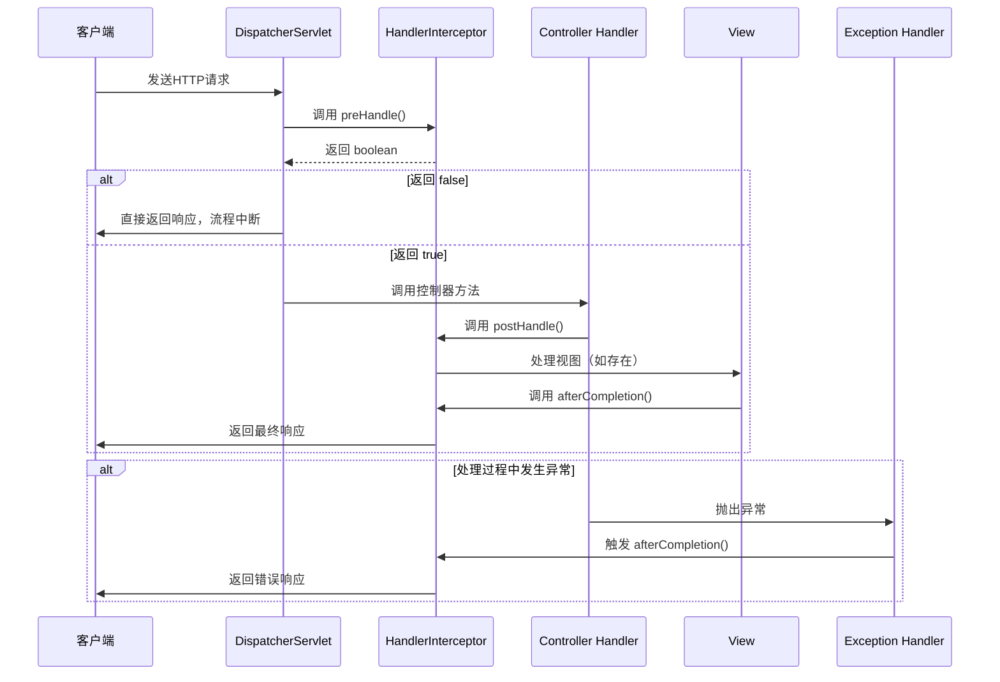

# RESTful API设计规范

### 1. 资源导向设计 (Resource-Oriented)
核心思想：将一切视为资源，使用名词而非动词

|资源类型	|示例	|说明|
|-|-|-|
|集合资源|	/users|	用户集合|
|单个资源	|/users/{id}	|特定用户|
|子资源	|/users/{id}/orders	|用户的订单|


### 2. 统一接口 (Uniform Interface)
使用标准的 HTTP 方法操作资源：

|HTTP| 方法	|操作	|幂等性|	安全|
|-|-|-|-|-|
|GET	|获取资源	|是	|是|
|POST	|创建资源|	否|	否|
|PUT|	更新/替换资源|	是	|否|
|PATCH|	部分更新资源|	否|	否|
|DELETE|	删除资源	|是	|否|
对数据的正则处理。
### 3.统一的相应格式 (Representational State Transfer)


```java
public class ApiResponse<T> {

    private Integer code;
    private String message;
    private T data;
    private Long timestamp;

}
```

见entity/apiResponse.java

# 异常抛出

## 使用步骤

### 1.自定义各种异常类

```java
public class ResourceNotFoundException extends BaseException {

    public ResourceNotFoundException(String message) {
        super(404, message);
    }

    public ResourceNotFoundException(String message, Throwable cause) {
        super(404, message, cause);
    }
}
```
如ResouceNotFoundException、InvalidParameterException等。

### 2.使用全局异常处理器，处理不同的异常，然后返回统一的响应格式

```java
// 异常处理类的创建注解
@RestControllerAdvice
public class GlobalExceptionHandler {
    // 局部异常处理方法的创建注解
    @ExceptionHandler(BaseException.class)
    public ResponseEntity<ApiResponse<Object>> handleBaseException(BaseException e) {
        // 对不同异常的处理逻辑
        log.warn("业务异常: {}", e.getMessage());
        // 统一返回格式
        return ResponseEntity.status(HttpStatus.BAD_REQUEST)
                .body(ApiResponse.error(e.getCode(), e.getMessage()));
    }

    ......
}
```

见handler/GlobalExceptionHandler.java

# 参数校验

## 使用步骤

### 1.在java实体类中加入参数的校验注解(@NotBlank、@Size、@Pattern)，如：

```java
public class RegisterRequest {

    @NotBlank(message = "用户名不能为空")
    @Size(min = 3, max = 20, message = "用户名长度必须在3-20个字符之间")
    private String username;

    @NotBlank(message = "密码不能为空")
    @Size(min = 6, message = "密码长度至少6位")
    private String password;

    @Pattern(regexp = "^1[3-9]\\d{9}$", message = "手机号格式不正确")
    private String phone;

    private Boolean AdminRegister;
}
```

### 2.在controller中加入@valid注解，进行参数校验，如：

```java
@PostMapping("/register")
public ResponseEntity<ApiResponse<User>> register(@Valid @RequestBody RegisterRequest request) {
    User user = userService.register(request);
    return ResponseEntity.ok(ApiResponse.success(user, "注册成功"));
}
```

### 3.使用全局异常处理器，对参数校验失败的异常(MethodArgumentNotValidException.class)进行处理，返回统一的响应格式。

```java
// 处理参数验证异常（如@Validated失败）
@ExceptionHandler(MethodArgumentNotValidException.class)
public ResponseEntity<ApiResponse<Object>> handleValidationException(MethodArgumentNotValidException e) {
    log.warn("参数验证失败: {}", e.getMessage());

    // 提取所有字段错误信息
    StringBuilder errorMessage = new StringBuilder();
    e.getBindingResult().getFieldErrors().forEach(error -> {
        if (errorMessage.length() > 0) {
            errorMessage.append("; ");
        }
        errorMessage.append(error.getDefaultMessage());
    });

    return ResponseEntity.status(HttpStatus.BAD_REQUEST)
            .body(ApiResponse.error(400, errorMessage.toString()));
}
```


# interceptor的作用

### 拦截请求，在请求到达controller之前或者之后对请求进行处理，如：

- 登录信息验证
- 身份校验
## 使用的步骤

### 1.创建拦截器类(@Component)，如：
```java
@Component
public class JwtInterceptor implements HandlerInterceptor {

}
```
### 2.根据拦截器起作用的时期,重写preHandle、postHandle、afterCompletion方法，如：

```java
@Override
public boolean preHandle(HttpServletRequest request, HttpServletResponse response, Object handler) {
    String token = request.getHeader("Authorization");

    // 终端打印出token
    if (token == null) {
        throw new BusinessException(401, "请先登录");
    }

    // 验证token
    if (!jwtUtil.validateToken(token)) {
        throw new BusinessException(401, "登录已过期，请重新登录");
    }

    // 将用户ID存入请求属性
    Long userId = jwtUtil.getUserIdFromToken(token);
    String role = jwtUtil.getRoleFromToken(token);
    request.setAttribute("role", role);
    request.setAttribute("userId", userId);
    return true;
}
```
### 3.在WebConfig中配置需要拦截的url，如：

```java
@Override
public void addInterceptors(InterceptorRegistry registry) {
    registry.addInterceptor(jwtInterceptor)
            .addPathPatterns("/**")
            .excludePathPatterns("/user/login", "/user/register")
            .order(1);
```
## 其他:

### 关于多个拦截器的执行顺序:


    preHandle 按注册顺序执行

    Controller 方法 执行

    postHandle 按注册逆序执行

    afterCompletion 按注册逆序执行

### 如何注册:

```java
@Override
public void addInterceptors(InterceptorRegistry registry) {
    registry.addInterceptor(jwtInterceptor)        
            .order(1);
    // preHandle 1最先执行
    // postHandle, afterCompletion 1最后执行    
```


# sql库和javaEntity类的相互转换

sql库习惯下划线命名，java实体类习惯驼峰命名。

sql库中表的字段和java实体类的属性名不一致，需要进行转换。

### 1.使用@Result进行转换

```java
@Select("SELECT id, product_id, buyer_id, status, create_time, update_time FROM order WHERE id = #{id}")
@Results({
    @Result(property = "id", column = "id"),
    @Result(property = "productId", column = "product_id"),
    @Result(property = "buyerId", column = "buyer_id"),
    @Result(property = "status", column = "status"),
    @Result(property = "createTime", column = "create_time"),
    @Result(property = "updateTime", column = "update_time")
})
// property是java实体类的属性名，column是sql库中表的字段名
Order selectBasicById(Long id);
```
当然这样写十分麻烦

### 2.采用mybatis提供的设置

```yml
mybatis:
  configuration:
    map-underscore-to-camel-case: true
```
写入application.yml文件中，mybatis会自动将下划线命名的字段映射到驼峰命名的属性上。  

例如: 
    create_time -> createTime


# password加密

采用BCryptPasswordEncoder加密密码。(其实就一行，调用方法没了)。

```java
@Component
public class PasswordEncoder {

    private final BCryptPasswordEncoder encoder = new BCryptPasswordEncoder();

    public String encode(CharSequence rawPassword) {
        return encoder.encode(rawPassword);
    }

    public boolean matches(CharSequence rawPassword, String encodedPassword) {
        return encoder.matches(rawPassword, encodedPassword);
    }
}
```

不过呢我们在BCrypt的源代码615行中看到了这么一句话：

```java
if (!for_check && passwordb.length > 72) {
    throw new IllegalArgumentException("password cannot be more than 72 bytes");
}
```
密码的字节数不能超过72字节，所以我们需要注意一下。
我给设置的是max = 64，留一定空间，防止出现问题。

jwt的用户验证

分类



