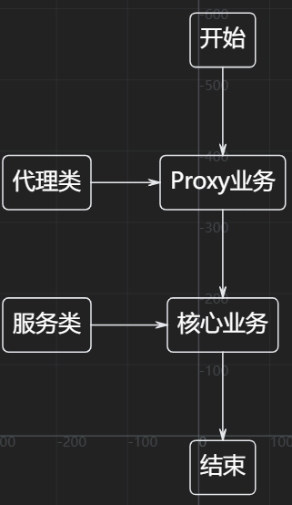

# 代理 Proxy

小明出去买菜，但是小明是个大学生，并不能判断哪些菜好，哪些菜不好。

于是小明找了一个大妈帮忙买菜，大妈会帮小明挑选好菜。

这样小明完成了买菜任务(核心业务逻辑)，并且还买到了优质的菜(增强功能)。



## 实现原理

```java
public interface IBuyFood {
    void buy();
}

public class XiaoMingBuyFood implements IBuyFood {
    public void buy() {
        // 核心业务逻辑
        System.out.println("小明正在买菜...");
        System.out.println("小明买好菜了");

    }
}

public class BuyFoodProxy{
    private IBuyFood realBuyFood;

    public BuyFoodProxy(IBuyFood realBuyFood) {
        this.realBuyFood = realBuyFood;
    }

    public void buy() {
        // 增强功能
        System.out.println("小明正在找大妈帮忙...");
        System.out.println("大妈正在帮小明挑选菜...");
        realBuyFood.buy();
    }
}

```

这样可以让核心业务和增强功能解耦

