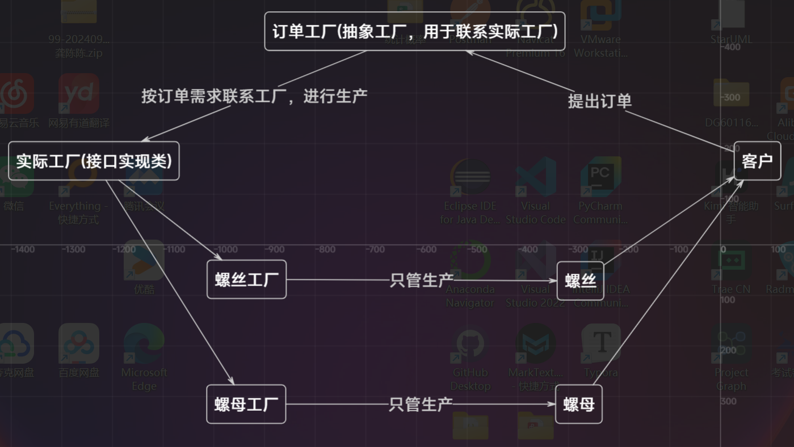
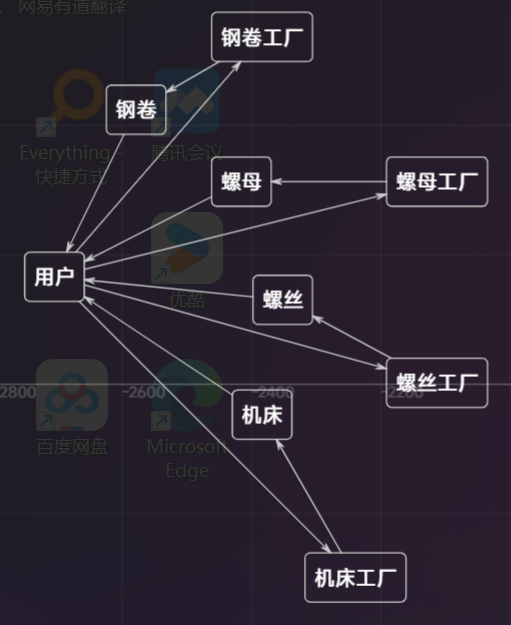

# 工厂模式

在学习spring控制反转并注入那块，提及到了工厂相关的知识。

本文档对工厂进行部分学习

## 对工厂方法的理解

四川有一家零部件生产公司，他们最开始只有生产**螺丝**，**螺母**的订单选项，在**不同的地方**进行加工

周围的人都记得住，这家公司可以生产螺丝，又可以生产螺母。就直接去**对应的地方**找人做订单，搞生产。毕竟就这么两个地方。

---

可是随着企业越办越大，他开始生产**钢管**，又生产**胶卷**，**机床**也可以定制，还可以买些**钢板**。不过仍然在不同的地方生产。

一位大老板过来了，一听自己都挺需要，挺想下订单，不过他发现螺丝就要去螺丝产地那订。钢板就要去钢板产地那订单子，怎么这么麻烦，不同的东西居然要去不同的地方订单子。

大老板刚好身边没人，跑这么多趟太折磨人。

---

这时我们的公司经理为了公司的业绩出来了。表示我这有一个集成的订单地方。你在这可以订所有想要的单子。

想要螺丝的单子，就给螺丝厂打个电话，

想要螺母的单子，就去螺母地打个电话。

其他的也是如此。

大老板一用。哎挺好，单子一下子就定完了。

---

### 这就是工厂方法模式。



通过订单工厂(接口类)，延后了具体实现类的示例。让用户可以在**想要用的时候再使用**，并且是**想用什么就用什么**。



否则，当用户想要订多个东西，就得去不同的地方订，代码层面体现在极大繁琐了声明和创建对象的一步。

---

### 总之，工厂方法:

就是为了项目的解耦。

使项目有着良好的可扩展性。因为想要多加一个产品的产出，只需要增添一个工厂实现类。

用户层面的代码完全不需要进行修改。

## 工厂总览

| 模式 | 核心思想 | 适用场景 |
|------|----------|----------|
| **简单工厂** | 一个工厂，根据参数创建对象 | 创建逻辑简单，产品类型少 |
| **工厂方法** | 工厂接口，子类决定创建对象 | 需要扩展新产品 |
| **抽象工厂** | 创建产品家族 | 创建相关对象系列 |
| **静态工厂** | 类提供静态创建方法 | 替代构造函数，语义更明确 |
| **建造者** | 分步构建复杂对象 | 对象构造复杂，需要多个步骤 |
| **原型** | 通过复制创建对象 | 创建成本高，或基于现有对象 |
| **单例** | 确保唯一实例 | 需要全局唯一对象 |


## 代码层面

### 简单工厂 (Simple Factory)

通过switch语句直接写完逻辑。

```java
public class CarFactory {
    public static Car createCar(String type) {
        switch(type) {
            # 一个factory，通过switch语句，判断最终是什么产品
            case "tesla": return new Tesla();
            case "porsche": return new Porsche();
            case "byd": return new Byd();
            default: throw new IllegalArgumentException("Unknown car type");
        }
    }
}

// 使用
Car car = CarFactory.createCar("tesla");
```

每次增加一个产品，还要修改factory层面的代码。

---
### 工厂方法 (Factory Method)

将switch语句进行解耦书写，提高了代码的扩展性

```java
public interface CarFactory {
    Car createCar();
}

public class TeslaFactory implements CarFactory {
    public Car createCar() {
        return new Tesla();
    }
}

public class PorscheFactory implements CarFactory {
    public Car createCar() {
        return new Porsche();
    }
}
```
factory类在新增产品是没有改动。

---

### 抽象工厂模式 (Abstract Factory)

```java
// 抽象工厂
public interface GUIFactory {
    Button createButton();
    Checkbox createCheckbox();
    Dialog createDialog();
}

// 具体工厂 - Windows风格
public class WindowsFactory implements GUIFactory {
    public Button createButton() { return new WindowsButton(); }
    public Checkbox createCheckbox() { return new WindowsCheckbox(); }
    public Dialog createDialog() { return new WindowsDialog(); }
}

// 具体工厂 - Mac风格  
public class MacFactory implements GUIFactory {
    public Button createButton() { return new MacButton(); }
    public Checkbox createCheckbox() { return new MacCheckbox(); }
    public Dialog createDialog() { return new MacDialog(); }
}

// 使用
GUIFactory factory = new WindowsFactory();
Button button = factory.createButton();
Checkbox checkbox = factory.createCheckbox();
```
如果一个产品有很多个零部件，那么抽象工厂就把所有的方法写在一起。
确保了风格一致性，兼容性

---

### 静态工厂 (Static Factory Method)

```java
public class Car {
    private String brand;
    private String model;
    
    private Car(String brand, String model) {
        this.brand = brand;
        this.model = model;
    }
    
    // 静态工厂方法
    public static Car createSportsCar(String model) {
        return new Car("Porsche", model);
    }
    
    public static Car createElectricCar(String model) {
        return new Car("Tesla", model);
    }
    
    public static Car createLuxuryCar(String model) {
        return new Car("Mercedes", model);
    }
}

// 使用
Car sportsCar = Car.createSportsCar("911");
Car electricCar = Car.createElectricCar("Model S");
```
在产品类的实现里面直接加上了生产方法。

Integer.parseInt()就是静态工厂方法。

Integer里面包含了一个静态工厂方法，让用户可以直接通过字符串创建Integer对象。

---

### 建造者模式 (Builder Pattern)

```java
public class Computer {
    private String CPU;
    private String RAM;
    private String storage;
    private String graphicsCard;
    
    // 私有构造器
    private Computer(Builder builder) {
        this.CPU = builder.CPU;
        this.RAM = builder.RAM;
        this.storage = builder.storage;
        this.graphicsCard = builder.graphicsCard;
    }
    
    public static class Builder {
        private String CPU;
        private String RAM;
        private String storage;
        private String graphicsCard;
        
        public Builder setCPU(String CPU) {
            this.CPU = CPU;
            return this;
        }
        
        public Builder setRAM(String RAM) {
            this.RAM = RAM;
            return this;
        }
        
        public Builder setStorage(String storage) {
            this.storage = storage;
            return this;
        }
        
        public Builder setGraphicsCard(String graphicsCard) {
            this.graphicsCard = graphicsCard;
            return this;
        }
        
        public Computer build() {
            return new Computer(this);
        }
    }
}

// 使用
Computer computer = new Computer.Builder()
    .setCPU("Intel i7")
    .setRAM("16GB")
    .setStorage("1TB SSD")
    .setGraphicsCard("RTX 3080")
    .build();
```
---

### 原型模式 (Prototype Pattern)

```java
public abstract class Shape implements Cloneable {
    private String id;
    protected String type;
    
    abstract void draw();
    
    public String getType() { return type; }
    public String getId() { return id; }
    public void setId(String id) { this.id = id; }
    
    // 关键：实现clone方法
    public Object clone() {
        Object clone = null;
        try {
            clone = super.clone();
        } catch (CloneNotSupportedException e) {
            e.printStackTrace();
        }
        return clone;
    }
}

public class Rectangle extends Shape {
    public Rectangle() {
        type = "Rectangle";
    }
    
    @Override
    public void draw() {
        System.out.println("Drawing Rectangle");
    }
}

// 原型注册表（工厂角色）
public class ShapeCache {
    private static Map<String, Shape> shapeMap = new HashMap<>();
    
    public static Shape getShape(String shapeId) {
        Shape cachedShape = shapeMap.get(shapeId);
        return (Shape) cachedShape.clone(); // 返回克隆对象
    }
    
    // 初始化原型对象
    public static void loadCache() {
        Rectangle rectangle = new Rectangle();
        rectangle.setId("1");
        shapeMap.put(rectangle.getId(), rectangle);
        
        Circle circle = new Circle();
        circle.setId("2");
        shapeMap.put(circle.getId(), circle);
    }
}

// 使用
ShapeCache.loadCache();
Shape clonedShape = ShapeCache.getShape("1");
```

通过已有的对象来实现其他的对象。
避免了某些类实例化困难的问题。

---

### 单例模式 (Singleton Pattern)

```java
public class DatabaseConnection {
    private static DatabaseConnection instance;
    
    private DatabaseConnection() {
        // 私有构造器
    }
    
    // 工厂方法：获取单例实例
    public static DatabaseConnection getInstance() {
        if (instance == null) {
            instance = new DatabaseConnection();
        }
        return instance;
    }
    
    // 线程安全版本
    public static synchronized DatabaseConnection getThreadSafeInstance() {
        if (instance == null) {
            instance = new DatabaseConnection();
        }
        return instance;
    }
}

// 使用
DatabaseConnection db1 = DatabaseConnection.getInstance();
DatabaseConnection db2 = DatabaseConnection.getInstance();
// db1 == db2 为 true
```
保证每次都是使用的同一个对象，避免了重复链接等问题，实现了数据时刻共享

---


public interface NumberFactory {
    // 创建方法:
    Number parse(String s);

    // 获取工厂实例:
    static NumberFactory getFactory1() {
        return impl1;
    }

    static NumberFactory getFactory2() {
        return impl2;
    }

    static NumberFactory1 impl1 = new NumberFactoryImpl1();
    static NumberFactory2 impl2 = new NumberFactoryImpl2();
}

NumberFactory factory = NumberFactory.getFactory1();
Number result = factory.parse("123.456");
factory = NumberFactory.getFactory2();
Number result = factory.parse("789.012");