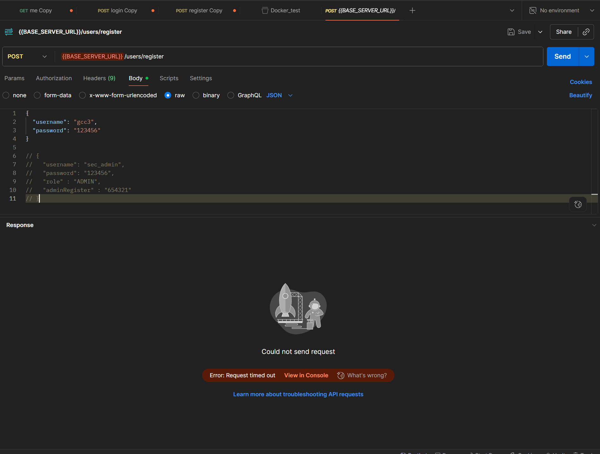
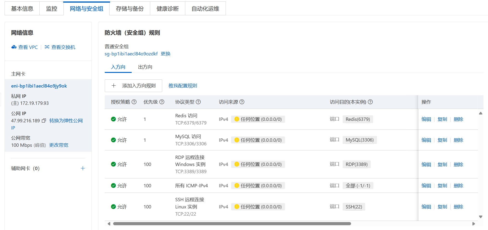
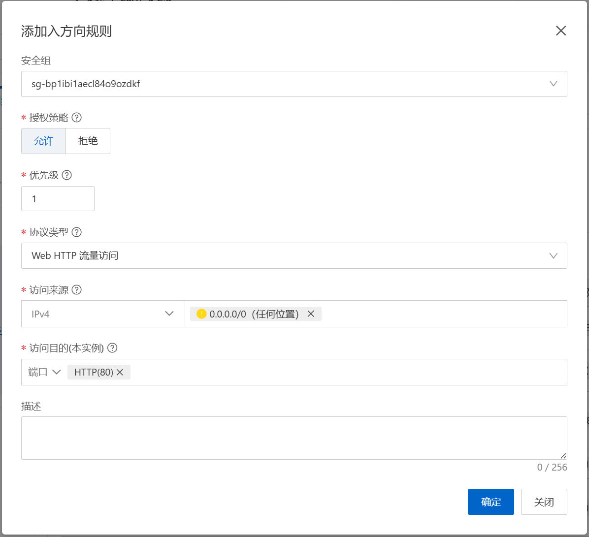
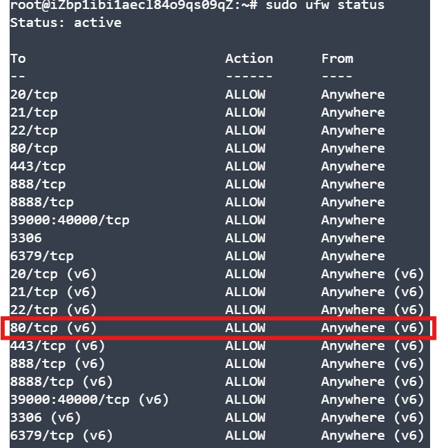
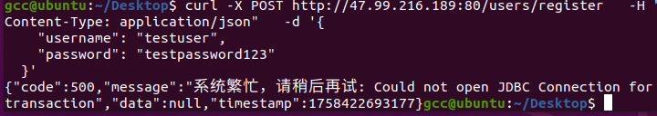
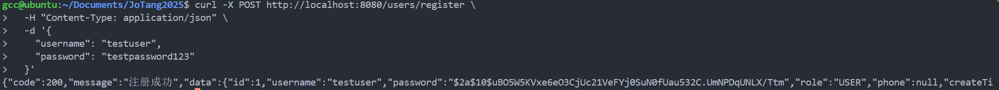
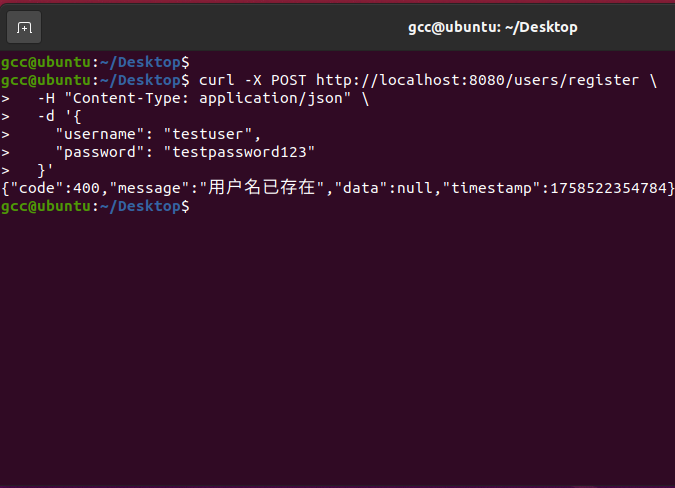

# 部署到服务器上


## 1.准备工作

### 先去阿里云整一台服务器

    这部分呢，领了阿里云的学生福利，然后选了个服务器。

    没什么可以说的

### 服务器上配置。

    我选择的是mysql和项目部署到同一台服务器上。所以mysql和redis的连接配置都要换成localhost。

    然后服务器上就创建相应的sql库，然后注册一下redis。这两步参考 sql.md 和 redis.md ，操作步骤一样

### 拉dockerhub上的镜像，运行容器

    docker操作见 docker.md ，这里不再赘述


在服务器上输入docker指令(查看容器是否正在运行):

    docker ps 

    CONTAINER ID   IMAGE                COMMAND                  CREATED        STATUS         PORTS                                     NAMES
    a4fa96cc0360   iamfs/my-pro:1.0.0   "java -jar /app/app.…"   17 hours ago   Up 2 minutes   0.0.0.0:80->8080/tcp, [::]:80->8080/tcp   my-spring-app-prod

为了验证，可以在服务器上进行curl的访问测试

```bash
curl -X POST http://localhost/users/register \
  -H "Content-Type: application/json" \
  -d '{
    "username": "testuser",
    "password": "testpassword123"
  }'  
```
如果正常返回你在开发时返回的json格式数据，那么容器就在运行


### 对安全组，端口的配置。

查看PORTS一列， 可以看到我的项目使用服务器(宿主机)的80端口映射容器的8080端口。

所以我们接下来就需要配置80端口的安全组，允许来自任何来源的80端口的访问。

如果不配置，那么外部的请求将无法访问到服务器上的容器:



#### **那么要配哪些东西呢?**

通过一系列的查询，发现要配置阿里云服务器的安全组，还要配置服务器的防火墙。

#### 1. 阿里云服务器的安全组配置

阿里云服务器的安全组配置，新建一个可以允许来自任何来源的80端口的访问。





#### 2. 服务器的防火墙配置

```bash
sudo ufw allow 80/tcp
sudo ufw status
sudo ufw reload
```



两层配置好了之后，才能进行外部机子的测试




---

## **问题出现**

刚才的图片中可能已经发现了，JDBC连不上，因为我们的docker部署的时候，sql和redis的访问地址也要变。

之前是硬编码为开发环境的ip地址，现在肯定会连不上

## 2.接下来解决sql和redis的链接，也有两种办法

### 1.首先是像开发环境一样的在服务器上安装sql和redis

```bash
# 通过apt安装
sudo apt install mysql-server redis-server
```

这种方式呢在AI嘴里是一种比较繁琐且安全性低的方式。

    因为我们要打开服务器对于3306和6479也就是sql和redis的特定端口。

    然后配置文件中硬编码为服务器的ip地址，用户和密码也相应改变。

```yaml
datasource:
    # JDBC 连接字符串
    # 格式: jdbc:mysql://<主机地址>:<端口>/<数据库名>?参数键值对
    url: jdbc:mysql://服务器地址:3306/JoTang2025?useSSL=false
# redis 同理
```

嗯既然学都学到这了，那我们为什么只学这个部署呢，肯定也得学习更加现代化的**docker-compose**部署方式

### 2. 第二种方式是使用docker-compose

    这种呢不是在服务器上安装sql和redis，而是从docker上拉取sql和redis的镜像进行容器部署，

    也就是说不仅部署了我们自己的spring项目，也一起部署了sql和redis，省去了sql和redis的安装配置。

最关键的是:

    其实我们是把项目直接传到了服务器上，甚至后期项目上传hub，那我们只需要写一个docker-compose.yml文件，指令运行文件就可以部署。

    真正的一键部署

    如果上传源码，那么我们并没有完成最开始的生产环境的镜像生成，上传镜像，然后服务器拉取镜像，运行容器。

    而是服务器本地获取源代码，通过docker-compose，生成项目镜像然后完成容器运行，并且在必要的时候从dockerhub上拉取其他需要的镜像(比如redis和mysql)

    这在连不上dockerhub时挺好用。

    当然更严谨的方式是把自己的项目也推送到dockerhub上，然后服务器通过一个文件全部部署。

---

**怎么做呢:**

#### 1.需要先写docker-compose.yml配置文件了，放在项目根目录，和dockerfile一个位置。

这是选择第一种，把代码全部丢到服务器上的部署方式


```yml
# docker-compose-dev.yml
version: '3.7'
services:
  app:
    # 传代码上去，所以这是build，不是image
    build: .
    container_name: my-app-dev
    ports:
      - "8080:8080"
    # 关键：将本地代码目录“绑定挂载”到容器内，覆盖掉构建时复制的文件。
    environment:
      - SPRING_PROFILES_ACTIVE=dev
      # mysql 配置
      - SPRING_DATASOURCE_URL=jdbc:mysql://mysql-db:3306/JoTang2025?useSSL=false&allowPublicKeyRetrieval=true&serverTimezone=UTC
      - SPRING_DATASOURCE_USERNAME=gcc
      - SPRING_DATASOURCE_PASSWORD=1234 
      # redis 配置  
      - SPRING_REDIS_HOST=redis-cache  
      - SPRING_REDIS_PASSWORD=1234  
      - SPRING_REDIS_PORT=6379
    depends_on:
      - mysql-db
      - redis-cache

  mysql-db:
    image: mysql:8.0
    container_name: mysql-db-dev
    environment:
      MYSQL_ROOT_PASSWORD: my_strong_password
      MYSQL_DATABASE: JoTang2025
      MYSQL_USER: gcc
      MYSQL_PASSWORD: 1234
      # MYSQL_HOST: '%'
    volumes:
      - ./db-init:/docker-entrypoint-initdb.d  # 挂载初始化脚本目录
      - mysql_data:/var/lib/mysql
    # 映射端口：格式 - "宿主机端口:容器内端口"
    ports:
      - "3306:3306" # 可选，如果宿主机需要直接连接数据库才开放
    # MySQL 8.x 的认证插件配置
    command: 
      - --default-authentication-plugin=mysql_native_password
      - --character-set-server=utf8mb4
      - --collation-server=utf8mb4_unicode_ci
    restart: unless-stopped


  redis-cache:
    image: redis:6-alpine
    container_name: redis-cache-dev
    command: redis-server --requirepass 1234 --appendonly yes
    ports:
      - "6379:6379" # 暴露端口到本地
    volumes:
      - redis_data:/data

volumes:
  mysql_data:
  redis_data:
```

这里面app配置的是我们的spring项目。

之后是其他需要的镜像，比如sql和redis。

---

#### 2.但是这里的sql镜像，拉下来是没有初始化我们需要的库的。怎么办呢？

那我们就要自己配置数据库的信息，写sql的语句(如init-db/01-init-tables.sql)，

并且映射到容器自动运行的文件夹中，(也就是/docker-entrypoint-initdb.d)

docker-compose.yml文件中volumes配置如下:

```yaml
volumes:  
  - ./db-init:/docker-entrypoint-initdb.d  # 挂载初始化脚本目录
---
```

#### 3.redis较为简单。不需要像关系类数据库写初始化脚本。

没有什么要做的

---

## 3.开始部署(先本地尝试)

    使用 -f 指定使用开发版本的 compose 文件
    进行本地开发环境测试

    docker-compose -f docker-compose.yml up -d

    也可以切换到根目录然后直接

    docker-compose up -d

    但是要确保只有一个docker-compose文件

---

### 期间出现的问题挺多，

#### 1.无法访问docker的守护进程

    要把用户注册到docker里面

    sudo usermod -aG docker $USER

    然后重启

#### 2.sql的3306被占用了
```bash
# 报错信息
WARNING: Image for service app was built because it did not already exist. To rebuild this image you must use `docker-compose build` or `docker-compose up --build`.
Creating mysql-db-dev ... 
Creating mysql-db-dev    ... error
WARNING: Host is already in use by another container


ERROR: for mysql-db-dev  Cannot start service mysql-db: driver failed programming external connectivity on endpoint mysql-db-dev (b4b9b9126f1883a8923296fc887ad511faffb160ed1b401a05
Creating redis-cache-dev ... done


ERROR: for mysql-db  Cannot start service mysql-db: driver failed programming external connectivity on endpoint mysql-db-dev (b4b9b9126f1883a8923296fc887ad511faffb160ed1b401a0530141bffb3a12a): Error starting userland proxy: listen tcp4 0.0.0.0:3306: bind: address already in use
ERROR: Encountered errors while bringing up the project.
```
把本地的sql服务停了

---

#### 3.项目连不上
```bash
Attaching to my-app-dev
my-app-dev     | Error: Unable to access jarfile /app/app.jar
```
这个是路径出问题了，dockerfile里面改一下路径

---

#### 4.对sql和redis的测试
```bash
# 测试sql有没有建表成功
docker-compose exec mysql-db mysql -u gcc -p 
# 输入密码
1234
use JoTang2025;
show tables;

# 成功返回三个表
user
product
product_order
```

```bash
# redis测试
docker-compose exec redis-cache redis-cli -a 1234 ping

# 成功返回
Pong

# 可以设置和获取一个测试值
docker-compose -f docker-compose-dev.yml exec redis-cache redis-cli -a 1234
> SET test:key "Hello Redis"
> GET test:key
```

---

#### 5.如果还有其他的问题，可以通过`docker-compose logs app_name(mysql_db/app)`进行进一步的筛查
---

### 当docker-compose ps 显示:
```bash
     Name                    Command               State                          Ports                       
--------------------------------------------------------------------------------------------------------------
my-app-dev        java -jar /app/app.jar           Up      0.0.0.0:8080->8080/tcp,:::8080->8080/tcp           
mysql-db-dev      docker-entrypoint.sh --def ...   Up      0.0.0.0:3306->3306/tcp,:::3306->3306/tcp, 33060/tcp
redis-cache-dev   docker-entrypoint.sh redis ...   Up      0.0.0.0:6379->6379/tcp,:::6379->6379/tcp  
```

那么我们的项目兼sql、redis服务就本机部署好了

---

## 4.本机测试

ps指令全部显示up之后，就可以用本机进行测试

```bash
curl -X POST http://localhost:8080/users/register \
  -H "Content-Type: application/json" \
  -d '{
    "username": "testuser1",
    "password": "testpassword123"
  }'  
```

```bash
gcc@ubuntu:~/Documents/JoTangGit/JoTang2025/5_BackEnd/demo$ curl -X POST http://localhost:8080/users/register \
>   -H "Content-Type: application/json" \
>   -d '{
>     "username": "testuser1",
>     "password": "testpassword123"
>   }'  
{"code":200,"message":"注册成功","data":{"id":2,"username":"testuser1","password":"$2a$10$4NhY1TUOjkYyhEiAiSvguejMmR78pbsk.XbukzkeOy8yBBPVhXDMG","role":"USER","phone":null,"createT...
```

成功显示数据那就对了





## 然后上传代码到服务器。

第一种方法:

    通过ssh远程连接然后scp直接拷贝

    scp -r D:\demo root@47.99.216.189:/app

第二种:
    
    阿里云有workbench，偷懒点用上传zip文件再解压挺快

### 然后就是服务器相同的流程

```bash
# 当然先要整一个用户
sudo useradd -m <username>

# 设密码给权限
sudo passwd <username>

sudo usermod -aG sudo gcc
```

docker-compose下载。

安全进程权限。

然后应该可以愉快的docker-compose up -d了。~~(嗯至少我是这样的)~~

#### 然而速度真慢，跑up跑了30分钟了还没跑完，

那么我们可以开始把项目传成镜像推送hub，然后把镜像传服务器，这样就不需要服务器重构镜像了。


# 总结

```bash
# 设置8080端口或者80端口开放
sudo ufw allow 80/tcp(8080/tcp)

# 阿里云上设置防火墙开放

# docker-compose.yml文件书写

# 数据库脚本构建

# 运行
docker-compose up -d
```

