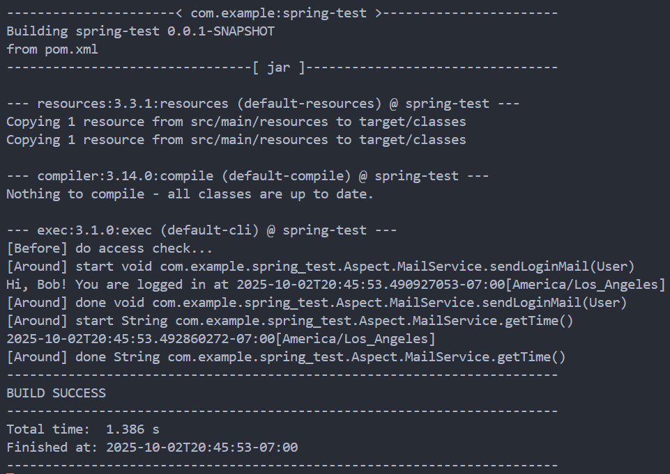
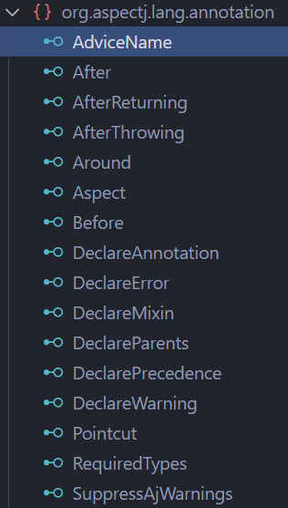
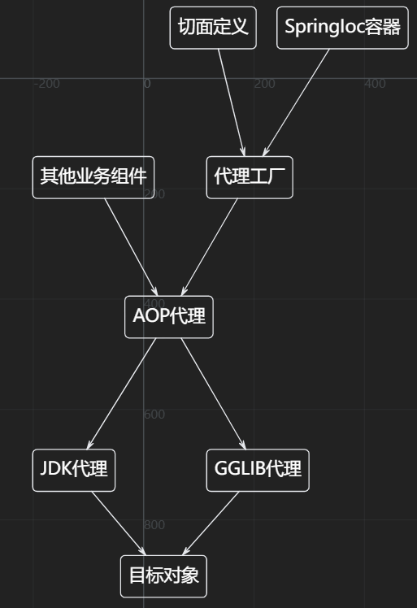

# AOP (Aspect Oriented Programming) 面向切面编程

Spring的第二核心内容就是AOP (Aspect Oriented Programming)

# 传统方法和SpringAOP方法的比较

## 传统方法:

```java
public class BookService {
    public void createBook(Book book) {
        securityCheck();
        Transaction tx = startTransaction();
        try {
            // 核心业务逻辑
            tx.commit();
        } catch (RuntimeException e) {
            tx.rollback();
            throw e;
        }
        log("created book: " + book);
    }

    public void updateBook(Book book) {
    securityCheck();
    Transaction tx = startTransaction();
    try {
        // 核心业务逻辑
        tx.commit();
    } catch (RuntimeException e) {
        tx.rollback();
        throw e;
    }
    log("updated book: " + book);
    }
}
```

可以看到每个方法里面其实核心业务的逻辑很少，全是其他的逻辑，比如安全检查、事务处理、日志记录等。

* 核心业务逻辑

* 切面逻辑

    * 安全检查

    * 日志

    * 事务处理

## Spring的AOP方法:

依赖引入

```xml
<dependency>
    <groupId>org.springframework.boot</groupId>
    <artifactId>spring-boot-starter-aop</artifactId>
</dependency>
```

```java
@Aspect
@Component
public class LoggingAspect {
    // 在执行UserService的每个方法前执行:
    @Before("execution(public * com.itranswarp.learnjava.service.UserService.*(..))")
    public void doAccessCheck() {
        System.err.println("[Before] do access check...");
    }

    // 在执行MailService的每个方法前后执行:
    @Around("execution(public * com.itranswarp.learnjava.service.MailService.*(..))")
    public Object doLogging(ProceedingJoinPoint pjp) throws Throwable {
        System.err.println("[Around] start " + pjp.getSignature());
        Object retVal = pjp.proceed();
        System.err.println("[Around] done " + pjp.getSignature());
        return retVal;
    }
}

@Configuration
@ComponentScan
// 注册类中加上自动代理
@EnableAspectJAutoProxy
public class AppConfig {

    public static void main(String[] args) {
        ApplicationContext context = new AnnotationConfigApplicationContext(AppConfig.class);
        UserService userService = context.getBean(UserService.class);
        User user = userService.login("bob@example.com", "password");

        MailService mailService = context.getBean(MailService.class);
        System.out.println(mailService.getTime());
    }
}
```



# AOP的全部注解

|注解|功能|
|-|-|
|@Before：|这种拦截器先执行拦截代码，再执行目标代码。如果拦截器抛异常，那么目标代码就不执行了；|
|@After：|这种拦截器先执行目标代码，再执行拦截器代码。无论目标代码是否抛异常，拦截器代码都会执行；|
|@AfterReturning：|和@After不同的是，只有当目标代码正常返回时，才执行拦截器代码；|
|@AfterThrowing：|和@After不同的是，只有当目标代码抛出了异常时，才执行拦截器代码；|
|@Around：|能完全控制目标代码是否执行，并可以在执行前后、抛异常后执行任意拦截代码，可以说是包含了上面所有功能。|

# AOP的注解使用

可以看到我们刚才的@Aspect类中@Before和@Around()里面写了一长串的AspectJ表达式，这些表达式就是切面的执行切点位置。

但是这样显然很复杂，而且这样书写，意味着类中的所有public方法都会进行切面逻辑的处理，全面覆盖，但实际上我们可能并不想如此.

这时我们就想到了事务处理的Transactional注解，我们也这样实现。

## 所以进行注解式切面引用。

比如我们对检测方法性能的功能进行切面编程

```java

@Aspect
@Component
public class MyAspect {

    // 环绕通知示例：测量方法执行时间
    @Around("@annotation(myAnnotation)")
    public Object aroundAdvice(ProceedingJoinPoint joinPoint, MyAnnotation myAnnotation) throws Throwable {
        String name = myAnnotation.value() == "" ? joinPoint.getSignature().getName() : myAnnotation.value();
        long start = System.currentTimeMillis();
        try {
            // 执行目标方法
            Object result = joinPoint.proceed();
            return result;
        } finally {
            long duration = System.currentTimeMillis() - start;
            System.out.println(name + " executed in " + duration + "ms");
        }
    }
}


@Target(ElementType.METHOD) // 注解用于方法
@Retention(RetentionPolicy.RUNTIME) // 运行时保留
public @interface MyAnnotation {
    String value() default "";
}

// 然后需要的地方进行调用
@Component
public class CalImpl {

    @MyAnnotation("[累加函数]")
    public int addRange(int a, int b) {
        int sum = 0;
        for (int i = a; i <= b; i++) {
            sum += i;
        }
        return sum;
    }
}
```

### 注意Aspect中的@Around，语法是:
```java
@Around("@annotation(xxx)")
public Object aroundAdvice(ProceedingJoinPoint joinPoint, MyAnnotation xxx) throws Throwable {
    ...
}
```

其实里面写的什么就是你的**形式变量名**，真正绑定什么注解，其实是**函数里的参数类型**(MyAnnotation)决定的。

---

### Try语句不用和用的区别是什么呢

**用Try语句** 在遭遇异常的情况仍然会输出性能结果   
**不用Try语句** 就会直接抛出异常跑路

# AOP的核心概念

## 概念

    切面（Aspect）：模块化的关注点实现，包括连接点和通知。

    连接点（Joinpoint）：程序执行过程中能够插入切面的点，如方法调用。

    通知（Advice）：在连接点处执行的代码，如前置通知、后置通知、环绕通知等。

    切点（Pointcut）：定义哪些连接点上应该应用通知，通过表达式进行定义。

    织入（Weaving）：将切面应用到目标对象并创建代理对象的过程。

## Advice类型



* 前置通知（Before advice）：在目标方法调用前执行，如安全检查、事务处理等。

* 后置通知（After advice）：在目标方法调用后执行，如记录日志、释放资源等。

* 环绕通知（Around advice）：在目标方法调用前后执行，如性能监控、事务处理等。

* 异常通知（Exception advice）：在目标方法抛出异常时执行，如记录异常日志、事务回滚等。

* 正常返回通知（After returning advice）：在目标方法正常返回时执行，如缓存更新等。

* 抛出异常通知 （After throwing advice）：在目标方法抛出异常时执行，如记录异常日志、事务回滚等。

```java
// 6. 后置通知：记录方法正常结束
@AfterReturning(pointcut = "applicationLayer()", returning = "result")
public void logMethodExit(JoinPoint joinPoint, Object result) {
    if (log.isDebugEnabled()) {
        String className = joinPoint.getTarget().getClass().getSimpleName();
        String methodName = joinPoint.getSignature().getName();
        
        log.debug("【方法返回】{}.{}() 结果: {}", className, methodName, formatResult(result));
    }
}

// 7. 异常通知：记录方法异常
@AfterThrowing(pointcut = "applicationLayer()", throwing = "ex")
public void logMethodException(JoinPoint joinPoint, Exception ex) {
    String className = joinPoint.getTarget().getClass().getSimpleName();
    String methodName = joinPoint.getSignature().getName();
    Object[] args = joinPoint.getArgs();
    
    log.error("【方法异常】{}.{}() 参数: {}，异常: {}", 
                className, methodName, formatArgs(args), ex.getMessage(), ex);
}

// 8. 环绕通知：完整的日志记录（整合了你的性能监控）
@Around("applicationLayer()")
public Object logAround(ProceedingJoinPoint joinPoint) throws Throwable {
    String className = joinPoint.getTarget().getClass().getSimpleName();
    String methodName = joinPoint.getSignature().getName();
    Object[] args = joinPoint.getArgs();
    
    // 记录方法开始
    long startTime = System.currentTimeMillis();
    if (log.isInfoEnabled()) {
        log.info("▶️ 开始执行 {}.{}()，参数: {}", className, methodName, formatArgs(args));
    }
    
    try {
        // 执行目标方法
        Object result = joinPoint.proceed();
        
        // 记录方法成功结束
        long endTime = System.currentTimeMillis();
        if (log.isInfoEnabled()) {
            log.info("✅ {}.{}() 执行成功，耗时: {}ms，返回: {}", 
                    className, methodName, endTime - startTime, formatResult(result));
        }
        
        return result;
        
    } catch (Exception ex) {
        // 记录方法异常结束
        long endTime = System.currentTimeMillis();
        log.error("❌ {}.{}() 执行失败，耗时: {}ms，异常: {}", 
                    className, methodName, endTime - startTime, ex.getMessage(), ex);
        throw ex;
    }
}
```

## Aspect类中

### 主要的切点指示器

* execution - 最常用的指示器

语法:

    execution(修饰符? 返回类型 包名.类名.方法名(参数) 异常?)

```java
// 1. 匹配所有公共方法
@Pointcut("execution(public * *(..))")
public void anyPublicMethod() {}

// 2. 匹配所有以"get"开头的方法
@Pointcut("execution(* get*(..))")
public void getterMethods() {}

// 3. 匹配特定包下的所有方法
@Pointcut("execution(* com.example.service.*.*(..))")
public void servicePackage() {}

// 4. 匹配特定包及其子包下的所有方法
@Pointcut("execution(* com.example.service..*.*(..))")
public void servicePackageAndSubpackages() {}

// 5. 匹配特定类的所有方法
@Pointcut("execution(* com.example.service.UserService.*(..))")
public void userServiceMethods() {}

// 6. 匹配特定方法
@Pointcut("execution(* com.example.service.UserService.createUser(..))")
public void createUserMethod() {}

// 7. 匹配特定返回类型的方法
@Pointcut("execution(java.util.List *(..))")
public void methodsReturningList() {}

// 8. 匹配特定参数的方法
@Pointcut("execution(* *(java.lang.String, int))")
public void methodsWithStringAndInt() {}

// 9. 匹配至少有一个参数的方法
@Pointcut("execution(* *(*))")
public void methodsWithAtLeastOneParam() {}

// 10. 匹配任意参数的方法
@Pointcut("execution(* *(..))")
public void anyMethod() {}
```

*  within - 类型匹配指示器

用来包范围的匹配

```java
// 1. 匹配特定类型的所有方法
@Pointcut("within(com.example.service.UserService)")
public void withinUserService() {}

// 2. 匹配包下的所有类型
@Pointcut("within(com.example.service.*)")
public void withinServicePackage() {}

// 3. 匹配包及其子包下的所有类型
@Pointcut("within(com.example.service..*)")
public void withinServicePackageAndSubpackages() {}

// 4. 匹配实现了某个接口的所有实现类
@Pointcut("within(com.example.service.UserService+)")
public void withinUserServiceImpl() {}
```

以上解决了类中方法范围，包范围的覆盖问题。

# 系统性的看看AOP的实现原理



主要采用了代理的方法实现

