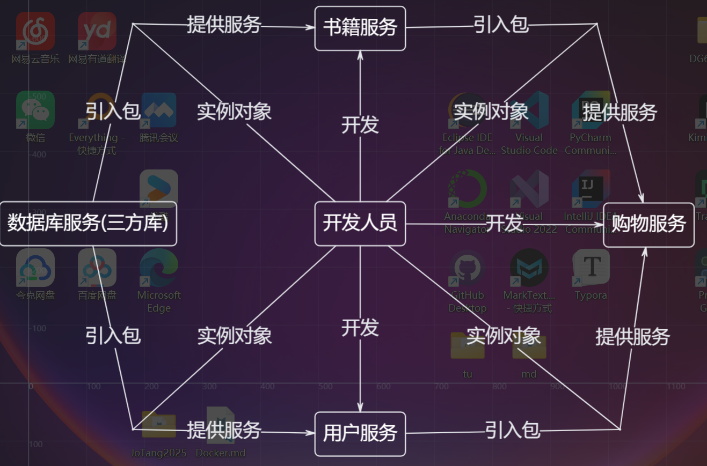
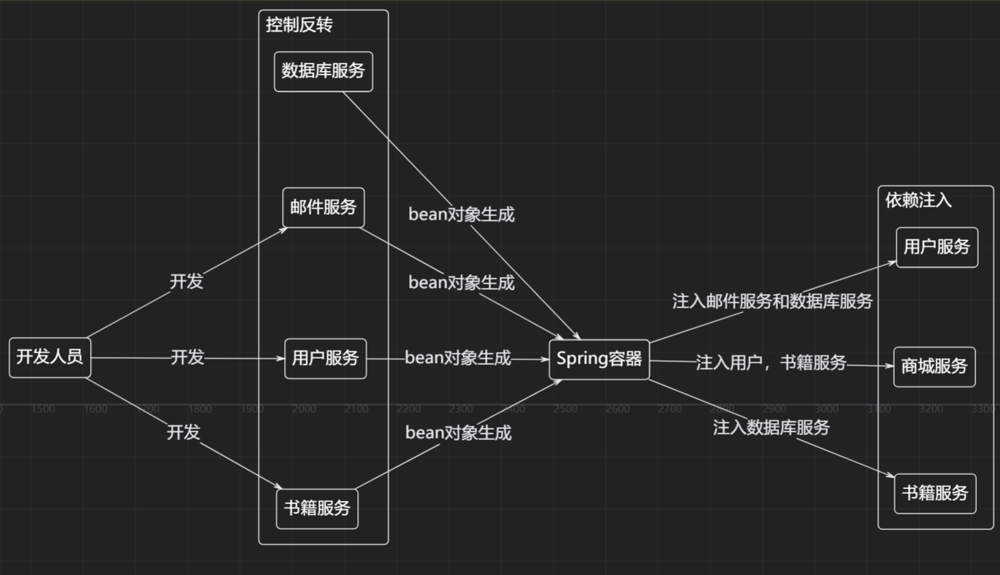

## [学习网址](https://liaoxuefeng.com/books/java/spring/ioc/basic/index.html)

# Ioc和DI

spring最核心的功能之一就是IoC和DI。

1. IoC（Inversion of Control）：控制反转，是一种设计模式，它是一种通过描述对象之间依赖关系来建立控制反转，从而实现对象之间的松耦合。

2. DI（Dependency Injection）：依赖注入，是指通过依赖关系注入的方式，把对象之间的依赖关系交给容器来管理。

spring框架极大减轻了配置，依赖的书写。实现了代码的解耦


## 传统方式与spring方式的对比

我们假定一个在线书店，通过BookService获取书籍：

### 传统方式：



```java
public class BookService {
    private HikariConfig config = new HikariConfig();
    private DataSource dataSource = new HikariDataSource(config);

    public Book getBook(long bookId) {
        try (Connection conn = dataSource.getConnection()) {
            ...
            return book;
        }
    }
}
// 需要使用数据库，于是声明并实例一个HikariDataSource，并且不得不再实例化Config
public class UserService {
    private HikariConfig config = new HikariConfig();
    private DataSource dataSource = new HikariDataSource(config);

    public User getUser(long userId) {
        try (Connection conn = dataSource.getConnection()) {
            ...
            return user;
        }
    }
}
// servlet里面又不得不引入刚才的Service。
public class CartServlet extends HttpServlet {
    private BookService bookService = new BookService();
    private UserService userService = new UserService();

    protected void doGet(HttpServletRequest req, HttpServletResponse resp) throws ServletException, IOException {
        long currentUserId = getFromCookie(req);
        User currentUser = userService.getUser(currentUserId);
        Book book = bookService.getBook(req.getParameter("bookId"));
        cartService.addToCart(currentUser, book);
        ...
    }
}
```

### spring方式：



**bean注册也有很多种方法，有xml文件，还有Annotation**

---

#### 采用xml

```xml
<?xml version="1.0" encoding="UTF-8"?>
<beans xmlns="http://www.springframework.org/schema/beans"
    xmlns:xsi="http://www.w3.org/2001/XMLSchema-instance"
    xsi:schemaLocation="http://www.springframework.org/schema/beans
        https://www.springframework.org/schema/beans/spring-beans.xsd">
    <!-- 需要注册的bean对象 -->
    <bean id="userService" class="com.itranswarp.learnjava.service.UserService">
    <!-- bean内部的其他的注入类-->    
        <property name="mailService" ref="mailService" />
    </bean>
    <bean id="mailService" class="com.itranswarp.learnjava.service.MailService" />
</beans>
```

然后加载spring容器：

```java
// 配置类
ApplicationContext context = new ClassPathXmlApplicationContext("application.xml");
// 测试
// 获取Bean:
UserService userService = context.getBean(UserService.class);
// UserService正常调用:
User user = userService.login("bob@example.com", "password");
```

---
#### 采用Annotation

首先所有的bean都加上@compoent注解
```java
@Component
public class UserService {
    MailService mailService;

    public UserService(@Autowired MailService mailService) {
        this.mailService = mailService;
    }
    ...
}

@Component
public class UserService {
    //或者
    // 然后在需要注入的地方加上Autowired注解
    @Autowired
    MailService mailService;

    ...
}

// 配置类的注解，因为后面要传自己
@Configuration
// 扫描当前包及其子包
@ComponentScan
public class AppConfig {
    public static void main(String[] args) {
        // 然后是配置类
        ApplicationContext context = new AnnotationConfigApplicationContext(AppConfig.class);
        // 下面的是测试，主要就是context一句
        UserService userService = context.getBean(UserService.class);
        User user = userService.login("bob@example.com", "password");
        System.out.println(user.getName());
    }
}

```

此时我们的可以看到采用spring进行IoC的配置，可以很方便的管理bean，并且可以自动注入依赖。

## spring的Ioc

刚才我们仅仅是在注入我们**自己的类**，比如BookService，UserService等。

那如果我想注册**第三方的bean对象**呢？如果有@Component注解，那挺好办，容器注入就可以了，尤其是那种没有标注@Component怎么办呢？

比如HikariDataSource。

其他的注入细节又有什么呢

---

### 配置并使用第三方Bean对象

直接再写一个配置类，然后通过@Bean注册一个Bean对象。

```java
import com.zaxxer.hikari.HikariConfig;
import com.zaxxer.hikari.HikariDataSource;
import org.springframework.context.annotation.Bean;
import org.springframework.context.annotation.Configuration;
import javax.sql.DataSource;
import java.util.Properties;

@Configuration
public class DataSourceConfig {

    @Bean(name = "dataSource")
    public HikariDataSource getDataSource(){
        Properties props = new Properties();    
        props.setProperty("jdbcUrl","jdbc:mysql://localhost:3306/springIoc?characterEncoding=utf-8&serverTimezone=GMT%2B8&useSSL=false");    
        props.setProperty("username","root");    
        props.setProperty("password","1234");    
        HikariConfig config = new HikariConfig(props);    
        config.addDataSourceProperty("cachePrepStmts", "true");    
        return new HikariDataSource(config);
    }
}
```

---

### 需要注意的是@ComponentScan的范围，

做项目时是直接使用的Boot框架，@ComponentScan是包装在@SpringBootApplication里面，所以Config写在Application启动类同级的包里就可以了。就像我现在的demo项目一样。

如果不是，那么就要确保Scan的范围，

**@ComponentScan**只能扫描当前类的包和子包，当然也可以指定扫描位置

@ComponentScan(basePackages = {"com.itranswarp.learnjava"})

---

### @Scope注解

@Component的bean都是单例bean对象Singleton

如果要实现其他的类型bean，比如原型bean

就可以使用注释@Scope("prototype")。

### 对bean接口的不同实现，可以用List<BeanType>进行包装

```java
public interface MeddleComponent{
    public void doSomething();
}

@Component
// 记录注入的顺序
@Order(1)
public class MeddleComponentImpl1 implements MeddleComponent{
    public void doSomething(){
        System.out.println("do something");
    }
}

@Component
@Order(2)
public class MeddleComponentImpl2 implements MeddleComponent{
    public void doSomething(){
        System.out.println("do something else");
    }
}

public class Service{
    @Autowired
    List<MeddleComponent> meddleComponents;
}
```

---

### 初始化和销毁时的附加操作

一般还会再bean初始化和销毁的时候进行日志的提示，或者其他的操作。

采用@PostConstruct，和@PreDestroy进行初始化和销毁时的附加操作。

```java
@PostConstruct
public void init() {
    System.out.println("init");
}

@PreDestroy
public void Destroy() {
    System.out.println("destroy");
}
```

---

### 多个Bean对象可以进行重命名

* @Bean("NewBeanName")

* @Component("NewBeanName")

#### 那么Bean和Component的初始名字是什么呢？

* Component的名字是**类名首字母小写**，

* Bean的名字是**方法名**。

---

### 注入时指定对象

当同一个Bean接口有多个实现，那么我们就不能只用接口声明。(以刚才的代码为例)

```java
// 此时不能直接用
@AutoWired
public MeddleComponent meddleComponent;
```

或者是传统的context中拿去也不行

```java
MeddleComponent component = context.getBean(MeddleComponent.class);
component.doSomething();
```

就会报错，因为不知道要用哪个:


---

#### 所以我们需要对需要注入的对象进行指定

可以在注入的时候进行指定

```java
@AutoWired
// 如果没有指定名称，那就是默认名称
@Qualifier("meddleComponent1")
public MeddleComponent meddleComponent;
```

或者把某一个bean对象设置为主要注入对象。进行隐指定

```java
@Component
// 记录注入的顺序
@Order(1)
@Primary
public class MeddleComponentImpl1 implements MeddleComponent{
    public void doSomething(){
        System.out.println("do something");
    }
}
```

### 字段的注入

有些时候还要注入配置文件中的各项配置，采用@PropertySource注解，然后在字段上加上@Value注解。

```java
@PropertySource("application.yml")
public class DataSourceConfig {

    @Value("${jdbc.url}")
    String url;

    @Value("${jdbc.username}")
    String username;

    @Bean
    public DataSource dataSource(){
        DataSource dataSource = new DataSource();
        dataSource.setUrl(url);
        dataSource.setUsername(username);
        return dataSource;

    }
```

还有从Bean对象进行配置的注入

```java
@Component
@PropertySource("application.yml")
public class SmtpConfig {
    @Value("${smtp.host}")
    private String host;

    @Value("${smtp.port:25}")
    private int port;

    public String getHost() {
        return host;
    }

    public int getPort() {
        return port;
    }
}

@Component
public class MailService {
    // 语法略有不同
    @Value("#{smtpConfig.host}")
    private String smtpHost;

    @Value("#{smtpConfig.port}")
    private int smtpPort;
}
```

### 条件注入

* 指定不同的环境@Profile("native")

native
test
production

在运行程序时，加上JVM参数`-Dspring.profiles.active=test`就可以指定以test环境启动。

---

* 根据类的关系进行配置。

```java
@Component
// 有OnSmtpEnvCondition类的时候才注入
@Conditional(OnSmtpEnvCondition.class)
public class SmtpMailService implements MailService {
    ...
}


@Component
// 通过配置进行条件装配
@ConditionalOnProperty(name="app.smtp", havingValue="true")
public class MailService {
    ...
}

@Component
文件中是否有该类
@ConditionalOnClass(name = "javax.mail.Transport")
public class MailService {
    ...
}

```
