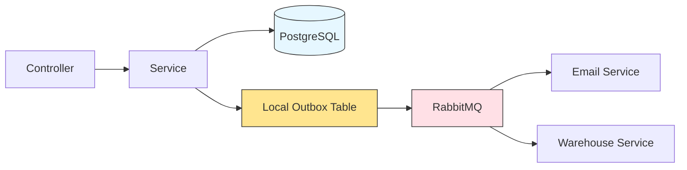
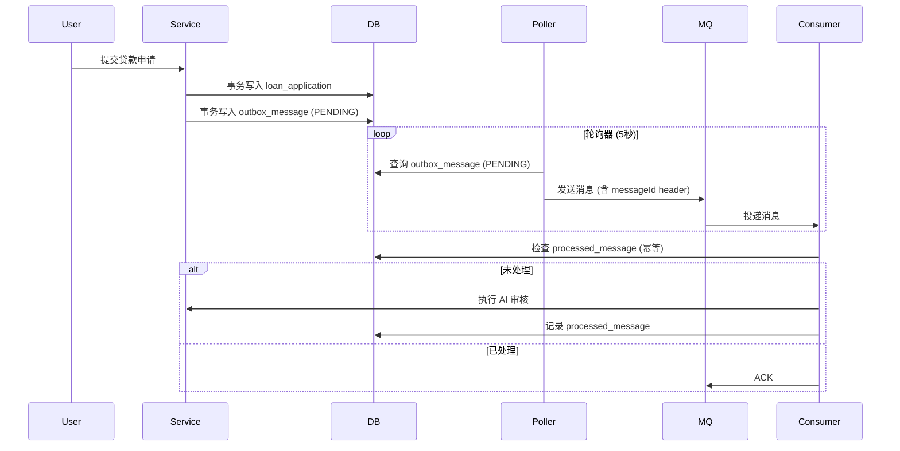

# RabbitMQ

[RabbitMQ官网](https://www.rabbitmq.com/)

## 什么是RabbitMQ

RabbitMQ是一个开源的AMQP（Advanced Message Queuing Protocol）实现，它是用于在分布式系统中存储和转发消息的消息队列。RabbitMQ支持多种消息队列协议，包括AMQP、STOMP、MQTT等。RabbitMQ的主要特征包括：

你可以把它想象成一个**邮局系统**。
-   当你想寄信时，你不会直接把信交给收件人，而是把信投递到邮局的邮箱里。
-   邮局会负责将信路由、分发给正确的收件人。
-   同样，在软件系统中，应用程序（生产者）把消息发送到 RabbitMQ，RabbitMQ 负责将消息存储、路由并最终交付给另一个应用程序（消费者）。


## RabbitMQ解决的问题

在没有消息队列的系统中，应用程序之间通常直接调用（如 HTTP API 调用），这会导致几个问题：

1.  **解耦**
    -   **问题**：服务A直接调用服务B，如果服务B宕机或接口变更，服务A也会立即受影响。
    -   **解决**：服务A只需把消息发给 RabbitMQ，就不用管了。服务B随时可以来取。服务A和服务B互不知晓对方的存在，实现了松耦合。

2.  **异步**
    -   **问题**：服务A调用一个耗时的服务B（如处理视频），服务A必须同步等待，导致响应慢，用户体验差。
    -   **解决**：服务A发送消息后立即返回，后台的服务B慢慢处理。实现了异步处理，提升了系统的响应速度和处理能力。

3.  **削峰填谷**
    -   **问题**：双十一秒杀时，瞬时流量巨大，后端服务可能因无法处理而崩溃。
    -   **解决**：将海量请求先存入 RabbitMQ 队列中，后端服务按照自己的能力从队列中拉取消息处理。消息队列像一个大坝，挡住了流量的洪峰，让后端服务平稳运行。

4.  **可靠性**
    -   **问题**：直接调用时，如果网络闪断或服务临时不可用，消息可能丢失。
    -   **解决**：RabbitMQ 提供消息持久化、确认机制等，确保消息不会在传递过程中丢失。


## RabbitMQ的核心概念

要理解 RabbitMQ，必须先掌握它的几个核心模型和术语。

1.  **Producer（生产者）**
    -   发送消息的程序。

2.  **Consumer（消费者）**
    -   接收消息的程序。

3.  **Queue（队列）**
    -   一个存储在 RabbitMQ 内部的缓冲区，它本质上是一个大的消息链表。生产者将消息投递到队列，消费者从队列中获取消息。
    -   **关键点**：消息只能存储在队列中。多个消费者可以监听同一个队列，但一条消息只会被其中一个消费者获取。

4.  **Exchange（交换机）**
    -   这是 RabbitMQ 最核心、最强大的部分。生产者并不是直接把消息发送到队列，而是发送到 **Exchange**。
    -   Exchange 根据特定的规则，将消息路由到一个或多个队列中。这个规则叫做 **Binding**。

5.  **Binding（绑定）**
    -   连接 Exchange 和 Queue 的规则。你可以把它理解为“路由表”。

6.  **Routing Key（路由键）**
    -   生产者发送消息给 Exchange 时，可以带一个 `Routing Key`。Exchange 会根据这个键和预先设定的 **路由规则** 来决定消息该投递到哪些队列。

7.  **Virtual Host（虚拟主机）**
    -   类似于一个命名空间，用于在同一个 RabbitMQ 服务器上实现资源（交换机、队列等）的隔离。不同的项目可以使用不同的 vhost，互不干扰。

**工作流程简述：**
`Producer` -> `Message` -> `Exchange` + `Routing Key` -> `Binding` -> `Queue` -> `Consumer`

所以工程开发，最重要的是设置不同的?

## Exchange 的类型（路由规则）

Exchange 的类型决定了消息路由的行为，这是 RabbitMQ 灵活性的关键。

1.  **Direct（直连）**
    -   **规则**：完全匹配 `Routing Key`。消息只会被投递到 `Binding Key` 与该 `Routing Key` **完全一致** 的队列。
    -   **比喻**：单播。比如，将错误日志（`routing_key=error`）只发送给专门处理错误的队列。

2.  **Fanout（扇出）**
    -   **规则**：忽略 `Routing Key`。它像广播一样，将消息投递到所有绑定到该 Exchange 的队列。
    -   **比喻**：广播。比如，用户注册成功后，需要同时给用户发邮件、发短信、写入数据库，就可以用 Fanout。

3.  **Topic（主题）**
    -   **规则**：模糊匹配 `Routing Key`。`Binding Key` 可以使用通配符：
        -   `*` (星号) 代表一个单词。
        -   `#` (井号) 代表零个或多个单词。
    -   **比喻**：组播。比如，`routing_key=usa.news` 的消息会匹配到 `binding_key=*.news` 和 `#.usa` 的队列。非常灵活，用于实现消息的发布/订阅。

4.  **Headers**
    -   **规则**：不依赖 `Routing Key`，而是根据消息的 Header 属性进行匹配。使用较少。

---

## 一个简单的例子：订单系统

假设我们有一个电商订单系统：

1.  **场景**：用户下单后，需要：
    -   扣减库存
    -   生成积分
    -   发送确认邮件

2.  **不使用 RabbitMQ**：订单服务需要依次同步调用库存服务、积分服务、邮件服务。任何一个服务慢或挂掉，都会导致下单失败，用户体验极差。

3.  **使用 RabbitMQ**：
    -   **生产者**：订单服务在用户下单后，向一个 `Fanout` 类型的 Exchange（比如叫 `order.fanout`）发送一条消息，内容为订单详情。
    -   **消费者**：
        -   库存服务绑定一个队列（`queue.stock`）到 `order.fanout`，从队列获取消息进行库存扣减。
        -   积分服务绑定另一个队列（`queue.points`）到 `order.fanout`，从队列获取消息来增加积分。
        -   邮件服务绑定第三个队列（`queue.email`）到 `order.fanout`，从队列获取消息来发送邮件。

    **优势**：
    -   **解耦**：订单服务完全不知道下游有哪些服务，新增一个服务（比如再加个短信服务）也无需修改订单服务的代码。
    -   **异步**：订单服务发送消息后即可返回，用户快速得到“下单成功”的响应。
    -   **削峰**：万一秒杀活动订单暴增，消息会积压在队列里，后端服务按自己的能力处理，不会被打垮。

---

## 优点与缺点

**优点：**
-   **成熟稳定**：基于 Erlang 语言开发，天生具备高并发和可靠性。
-   **灵活的路由**：多种 Exchange 类型提供了强大的消息路由能力。
-   **管理界面友好**：提供了易用的 Web 管理界面，可以监控和管理队列、连接、交换器等。
-   **跨语言支持**：提供了几乎所有主流编程语言的客户端库。
-   **社区活跃**：资料丰富，遇到问题容易找到解决方案。

**缺点：**
-   **Erlang 技术栈**：对于主要使用 Java/Python/Go 的团队来说，二次开发和深度定制有学习成本。
-   **性能**：相比一些新兴的消息队列（如 Kafka、Pulsar），在绝对的吞吐量上可能稍逊一筹。RabbitMQ 更擅长于业务消息的精准路由和处理，而 Kafka 更擅长于高吞吐的日志流处理。
-   **集群扩展**：虽然支持集群，但扩展性不如 Kafka 那样线性简单。

# SpringBoot整合RabbitMQ

## docker部署

```yml
rabbitmq:
    image: rabbitmq:4.2.0-management
    container_name: rabbitmq
    restart: unless-stopped
    environment:
      RABBITMQ_DEFAULT_USER: admin
      RABBITMQ_DEFAULT_PASS: admin123
      # 可选：自定义 vhost
      # RABBITMQ_DEFAULT_VHOST: my_vhost
    ports:
      - "5672:5672"   # AMQP 客户端通信端口
      - "15672:15672" # Web 管理界面
    volumes:
      - rabbitmq_data:/var/lib/rabbitmq
      - rabbitmq_log:/var/log/rabbitmq
    networks:
      - messaging
```

## 引入依赖

```xml
<dependency>
    <groupId>org.springframework.boot</groupId>
    <artifactId>spring-boot-starter-amqp</artifactId>
</dependency>
```

## 配置文件

```yaml
spring:
  rabbitmq:
    host: 127.0.0.1
    port: 5672
    username: admin
    password: admin123
    virtual-host: /
```

## 工程化RabbitMQ的使用

### 简单的消息单一发送

Order-message -> Orderproducer -> exchange -> queue -> Emailconsumer(进行短信发送)

```java
// RabbitConfig.java
@Configuration
public class RabbitConfig {

    public static final String ORDER_QUEUE = "order.created";
    public static final String ORDER_EXCHANGE = "order.exchange";
    public static final String ORDER_ROUTING_KEY = "order.create";

    public static final String DLQ = "order.dlq"; // 死信队列
    public static final String DLX = "dlx"; // 死信交换机

    @Bean
    public Queue orderQueue() {
        // 定义一个持久化的订单队列，并配置死信交换机和路由键
        return QueueBuilder.durable(ORDER_QUEUE)
                // 失败的消息，转移到死信交换机，并且设置路由键为DLQ。
                // 这两行现在不用管。
                .deadLetterExchange(DLX)
                .deadLetterRoutingKey(DLQ)
                .build();
    }

    @Bean
    public DirectExchange orderExchange() {
        // 定义业务交换机，用于接收订单创建消息
        return new DirectExchange(ORDER_EXCHANGE);
    }

    @Bean
    public Binding orderBinding() {
        // 绑定订单队列到业务交换机
        // 规则：路由键为"order.create"的消息会被路由到订单队列
        return BindingBuilder.bind(orderQueue())
                .to(orderExchange())
                .with(ORDER_ROUTING_KEY);
    }
}

// RabbitUtil.java
// 对原生的RabbitTemplate进行封装
@Component
public class RabbitUtil {

    @Autowired
    private RabbitTemplate rabbitTemplate;

    /*
     * 向指定队列发送消息
     * @param queueName 队列名称
     * @param routingKey 路由键
     * @param message 消息内容
     */
    public void send(String queueName,String routingKey ,Object message) {
        rabbitTemplate.convertAndSend(queueName, routingKey,message);
    }

    /*
     * 获取消息的delivery tag
     * @param message 消息对象
     * @return delivery tag
     */
    public Long getTag(Message message) {
        return message.getMessageProperties().getDeliveryTag();
    }
}

// Orderproducer.java
@Service
public class OrderProducer {

    @Autowired
    private RabbitUtil rabbitUtil;

    public void sendOrderCreated(Order order) {
        rabbitUtil.send(RabbitMQConfig.ORDER_QUEUE, RabbitMQConfig.ORDER_ROUTING_KEY, order);
        System.out.println(" [x] Sent OrderCreated event: " + order.getId());
    }
}

// Emailconsumer.java
@Component
public class EmailConsumer {

    @Autowired
    private RabbitUtil rabbitUtil;
    /*
     * 
     */
    @RabbitListener(queues = RabbitMQConfig.ORDER_QUEUE)
    public void handleOrderCreated(Order order, Message message, Channel channel) throws IOException {
        // 获取 delivery tag,这是 RabbitMQ 用来标识消息的唯一 ID
        long tag = rabbitUtil.getTag(message);

        try {
            // 模拟发邮件（实际可调用邮件服务）
            System.out.println(" [📧] Sending email for order: " + order.getId()
                    + " to user: " + order.getUserId());

            // 模拟可能失败（比如订单ID为999时）
            if (order.getId() != null && order.getId() == 999L) {
                throw new RuntimeException("Simulated email failure!");
            }

            // 成功：ACK
            channel.basicAck(tag, false);
            System.out.println(" [✅] Email sent for order: " + order.getId());

        } catch (Exception e) {
            System.err.println(" [❌] Failed to send email: " + e.getMessage());
            // 拒绝且不 requeue → 进入 DLQ
            channel.basicNack(tag, false, false);
        }
    }
}

```

#### 消费者中Message

Message 对象
├── messageProperties (消息属性)
│   ├── contentType: "application/json"
│   ├── contentEncoding: "UTF-8"
│   ├── headers: {key: value}
│   ├── deliveryTag: 12345
│   └── timestamp: ...
└── body (消息体 - 二进制数据)
└── 你的 Order 对象序列化后的字节数据


### MQ和DB混合使用


