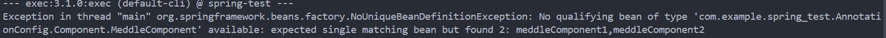
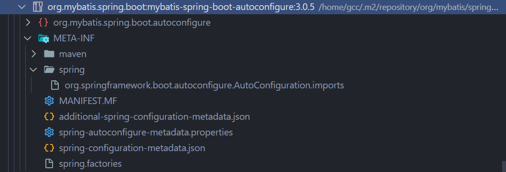

## [学习网址](https://liaoxuefeng.com/books/java/spring/ioc/basic/index.html)

# Ioc和DI

> "Don't call us, we'll call you."（不要找我们，我们会找你）

spring最核心的功能之一就是IoC和DI。

1. IoC（Inversion of Control）：控制反转，是一种设计模式，它是一种通过描述对象之间依赖关系来建立控制反转，从而实现对象之间的松耦合。

2. DI（Dependency Injection）：依赖注入，是指通过依赖关系注入的方式，把对象之间的依赖关系交给容器来管理。

spring框架极大减轻了配置，依赖的书写。实现了代码的解耦


## 传统方式与spring方式的对比

我们假定一个在线书店，通过BookService获取书籍，然后在购物服务中记录用户购买的书籍：

### 传统方式：


```java
// 书籍服务
public class BookService {
    // 引入数据库
    // 需要使用数据库，于是声明并实例一个HikariDataSource，并且不得不再实例化Config
    private HikariConfig config = new HikariConfig();
    private DataSource dataSource = new HikariDataSource(config);

    public Book getBook(long bookId) {
        try (Connection conn = dataSource.getConnection()) {
            ...
            return book;
        }
    }
}

// 用户服务
public class UserService {
    // 引入服务
    private HikariConfig config = new HikariConfig();
    private DataSource dataSource = new HikariDataSource(config);

    public User getUser(long userId) {
        try (Connection conn = dataSource.getConnection()) {
            ...
            return user;
        }
    }
}
// servlet里面又不得不引入刚才的Service。
// web阶段，商城服务
public class CartServlet extends HttpServlet {
    // 引入前两服务
    private BookService bookService = new BookService();
    private UserService userService = new UserService();

    protected void doGet(HttpServletRequest req, HttpServletResponse resp) throws ServletException, IOException {
        long currentUserId = getFromCookie(req);
        User currentUser = userService.getUser(currentUserId);
        Book book = bookService.getBook(req.getParameter("bookId"));
        cartService.addToCart(currentUser, book);
        ...
    }
}
```

### spring方式：


**bean注册也有很多种方法，有xml文件，还有Annotation**

---

#### 采用xml

```xml
<?xml version="1.0" encoding="UTF-8"?>
<beans xmlns="http://www.springframework.org/schema/beans"
    xmlns:xsi="http://www.w3.org/2001/XMLSchema-instance"
    xsi:schemaLocation="http://www.springframework.org/schema/beans
        https://www.springframework.org/schema/beans/spring-beans.xsd">
    <!-- 需要注册的bean对象 -->
    <bean id="userService" class="com.itranswarp.learnjava.service.UserService">
    <!-- bean内部的其他的注入类-->    
        <property name="mailService" ref="mailService" />
    </bean>
    <bean id="mailService" class="com.itranswarp.learnjava.service.MailService" />
</beans>
```

然后加载spring容器：

```java
// 配置类
ApplicationContext context = new ClassPathXmlApplicationContext("application.xml");
// 测试
// 获取Bean:
UserService userService = context.getBean(UserService.class);
// UserService正常调用:
User user = userService.login("bob@example.com", "password");
```

---
#### 采用Annotation

首先所有的bean都加上@compoent注解
```java
@Component
public class UserService {
    MailService mailService;

    // 构造方法注入
    public UserService(@Autowired MailService mailService) {
        this.mailService = mailService;
    }
    // 还有setter注入
    @Autowired
    public void setMailService(MailService mailService) {
        this.mailService = mailService;
    }
    ...
}
//或者
@Component
public class UserService {
    // 然后在需要注入的地方加上Autowired注解
    @Autowired
    MailService mailService;
    ...
}

// 配置类的注解，因为后面要传自己
@Configuration
// 扫描当前包及其子包
@ComponentScan
public class AppConfig {
    public static void main(String[] args) {
        // 然后是配置类
        ApplicationContext context = new AnnotationConfigApplicationContext(AppConfig.class);
        // 下面的是测试，主要就是context一句
        UserService userService = context.getBean(UserService.class);
        User user = userService.login("bob@example.com", "password");
        System.out.println(user.getName());
    }
}

```

此时我们的可以看到采用spring进行IoC的配置，可以很方便的管理bean，并且可以自动注入依赖。

## spring的Ioc

刚才我们仅仅是在注入我们**自己的类**，比如BookService，UserService等。

那如果我想注册**第三方的bean对象**呢？如果有@Component注解，那挺好办，容器注入就可以了，尤其是那种没有标注@Component怎么办呢？比如HikariDataSource。

其他的注入细节又有什么呢

---


### 需要注意的是@ComponentScan的范围，

做项目时是直接使用的Boot框架，@ComponentScan是包装在@SpringBootApplication里面，所以Config写在Application启动类同级的包里就可以了。就像我现在的demo项目一样。

如果不是，那么就要确保Scan的范围，

**@ComponentScan**只能扫描当前类的包和子包，当然也可以指定扫描位置

@ComponentScan(basePackages = {"com.itranswarp.learnjava"})

---

### @Scope注解

@Component的bean都是单例bean对象Singleton

如果要实现其他的类型bean，比如原型bean

就可以使用注释@Scope("prototype")。

### 对bean接口的不同实现，可以用List<BeanType>进行包装

```java
public interface MeddleComponent{
    public void doSomething();
}

@Component
// 记录注入的顺序
@Order(1)
public class MeddleComponentImpl1 implements MeddleComponent{
    public void doSomething(){
        System.out.println("do something");
    }
}

@Component
@Order(2)
public class MeddleComponentImpl2 implements MeddleComponent{
    public void doSomething(){
        System.out.println("do something else");
    }
}

public class Service{
    @Autowired
    List<MeddleComponent> meddleComponents;
}
```

---

### 初始化和销毁时的附加操作

一般还会再bean初始化和销毁的时候进行日志的提示，或者其他的操作。

采用@PostConstruct，和@PreDestroy进行初始化和销毁时的附加操作。

```java
@PostConstruct
public void init() {
    System.out.println("init");
}

@PreDestroy
public void Destroy() {
    System.out.println("destroy");
}
```

### 完整声明周期呢

<details open>
<summary>点击查看代码</summary>


```java
// 
@Component
public class LifecycleBean implements 
    BeanNameAware, BeanFactoryAware, ApplicationContextAware,
    InitializingBean, DisposableBean {
    
    // 1. 实例化（构造函数）
    public LifecycleBean() {
        System.out.println("1. 构造函数");
    }
    
    // 2. 设置属性（依赖注入）
    @Autowired
    public void setDependency(OtherBean bean) {
        System.out.println("2. 依赖注入");
    }
    
    // 3. BeanNameAware
    @Override
    public void setBeanName(String name) {
        System.out.println("3. BeanNameAware: " + name);
    }
    
    // 4. BeanFactoryAware  
    @Override
    public void setBeanFactory(BeanFactory beanFactory) {
        System.out.println("4. BeanFactoryAware");
    }
    
    // 5. ApplicationContextAware
    @Override
    public void setApplicationContext(ApplicationContext context) {
        System.out.println("5. ApplicationContextAware");
    }
    
    // 6. BeanPostProcessor.postProcessBeforeInitialization
    
    // 7. @PostConstruct
    @PostConstruct
    public void postConstruct() {
        System.out.println("7. @PostConstruct");
    }
    
    // 8. InitializingBean
    @Override
    public void afterPropertiesSet() {
        System.out.println("8. InitializingBean");
    }
    
    // 9. 自定义 init 方法
    public void customInit() {
        System.out.println("9. 自定义init方法");
    }
    
    // 10. BeanPostProcessor.postProcessAfterInitialization
    
    // 业务使用阶段...
    
    // 销毁阶段：
    // 11. @PreDestroy
    @PreDestroy
    public void preDestroy() {
        System.out.println("11. @PreDestroy");
    }
    
    // 12. DisposableBean
    @Override
    public void destroy() {
        System.out.println("12. DisposableBean");
    }
    
    // 13. 自定义 destroy 方法
    public void customDestroy() {
        System.out.println("13. 自定义destroy方法");
    }
}
```

</details>

---

### 多个Bean对象可以进行重命名

* @Bean("NewBeanName")

* @Component("NewBeanName")

#### 那么Bean和Component的初始名字是什么呢？

* Component的名字是**类名首字母小写**，

* Bean的名字是**方法名**。

---

### 注入时指定对象

当同一个Bean接口有多个实现，那么我们就不能只用接口声明。(以刚才的代码为例)

```java
// 此时不能直接用
@AutoWired
public MeddleComponent meddleComponent;
```

或者是传统的context中拿去也不行

```java
MeddleComponent component = context.getBean(MeddleComponent.class);
component.doSomething();
```

就会报错，因为不知道要用哪个:



---

#### 所以我们需要对需要注入的对象进行指定

可以在注入的时候进行指定

```java
@AutoWired
// 如果没有指定名称，那就是默认名称
@Qualifier("meddleComponent1")
public MeddleComponent meddleComponent;
```

或者把某一个bean对象设置为主要注入对象。进行隐指定

```java
@Component
// 记录注入的顺序
@Order(1)
@Primary
public class MeddleComponentImpl1 implements MeddleComponent{
    public void doSomething(){
        System.out.println("do something");
    }
}
```

### 字段的注入

有些时候还要注入配置文件中的各项配置，采用@PropertySource注解，然后在字段上加上@Value注解。

```java
@PropertySource("application.yml")
public class DataSourceConfig {

    @Value("${jdbc.url}")
    String url;

    @Value("${jdbc.username}")
    String username;

    @Bean
    public DataSource dataSource(){
        DataSource dataSource = new DataSource();
        dataSource.setUrl(url);
        dataSource.setUsername(username);
        return dataSource;

    }
```

还有从Bean对象进行配置的注入

```java
@Component
@PropertySource("application.yml")
public class SmtpConfig {
    @Value("${smtp.host}")
    private String host;

    @Value("${smtp.port:25}")
    private int port;

    public String getHost() {
        return host;
    }

    public int getPort() {
        return port;
    }
}

@Component
public class MailService {
    // 语法略有不同
    @Value("#{smtpConfig.host}")
    private String smtpHost;

    @Value("#{smtpConfig.port}")
    private int smtpPort;
}
```

### 条件注入

* 指定不同的环境@Profile("native")

native
test
production

在运行程序时，加上JVM参数`-Dspring.profiles.active=test`就可以指定以test环境启动。

---

* 根据类的关系进行配置。

```java
@Component
// 有OnSmtpEnvCondition类的时候才注入
@Conditional(OnSmtpEnvCondition.class)
public class SmtpMailService implements MailService {
    ...
}

// 需要实现Condition接口
public class OnSmtpEnvCondition implements Condition {
    @Override
    public boolean matches(ConditionContext context, AnnotatedTypeMetadata metadata) {
        // 通过ConditionContext获取环境配置
        Environment environment = context.getEnvironment();
        // 检查是否存在app.smtp属性，并且其值为true
        return environment.getProperty("app.smtp", Boolean.class, false);
    }
}
```
**ConditionContext 接口提供了对当前条件上下文的访问。它包含以下主要信息和方法**

|方法|内容|
|--|--|
|getRegistry() |返回一个 BeanDefinitionRegistry，允许您访问和操作Bean定义注册表。|
|getBeanFactory() |返回一个 ConfigurableListableBeanFactory，允许您访问Bean工厂，获取Bean定义的详细信息。|
|getEnvironment() |返回一个 Environment，允许您访问应用程序的环境配置，例如属性文件中的配置。|
|getResourceLoader() |返回一个 ResourceLoader，允许您加载资源文件|。
|getClassLoader()| 返回一个 ClassLoader，允许您访问类加载器。|
|getBeanNameGenerator() |返回一个 BeanNameGenerator，允许您获取Bean名称生成器。|
|getReader() |返回一个 BeanDefinitionReader，允许您读取Bean定义。|

**AnnotatedTypeMetadata 接口提供了对类或方法上注解的元数据访问。它包含以下主要信息和方法：**

|方法|内容|
|--|--|
|getAnnotationAttributes(String annotationName) |返回指定注解的属性值，以 Map<string, object=""> 的形式返回。|
|getAnnotationAttributes(String annotationName, boolean classValuesAsString) |返回指定注解的属性值，可以选择是否将类值作为字符串返回。|
|getAnnotationClasses() |返回类上所有注解的类名集合。|
isAnnotated(String annotationName)|判断类或方法是否带有指定的注解。|
|getDeclaredMethods() |返回类中声明的所有方法的元数据。|

---
```java
@Component
// 通过配置进行条件装配
@ConditionalOnProperty(name="app.smtp", havingValue="true")
public class MailService {
    ...
}
```
```java
@Component
文件中是否有该类
@ConditionalOnClass(name = "javax.mail.Transport")
public class MailService {
    ...
}
```

```java
// 没bean才装配
@ConditionOnMissingBean(name = "mailService")
```

---

### 配置并使用自己的第三方Bean对象

有些时候spring自带的bean对象不能满足我们的要求，我们就要重新注册配置一个符合我们实际需求的bean。

**直接再写一个配置类，然后通过@Bean注册一个Bean对象。**

```java
import com.zaxxer.hikari.HikariConfig;
import com.zaxxer.hikari.HikariDataSource;
import org.springframework.context.annotation.Bean;
import org.springframework.context.annotation.Configuration;
import javax.sql.DataSource;
import java.util.Properties;

@Configuration
public class DataSourceConfig {

    @Bean(name = "dataSource")
    public HikariDataSource getDataSource(){
        Properties props = new Properties();    
        props.setProperty("jdbcUrl","jdbc:mysql://localhost:3306/springIoc?characterEncoding=utf-8&serverTimezone=GMT%2B8&useSSL=false");    
        props.setProperty("username","root");    
        props.setProperty("password","1234");    
        HikariConfig config = new HikariConfig(props);    
        config.addDataSourceProperty("cachePrepStmts", "true");    
        return new HikariDataSource(config);
    }
}
```

---

# 关于SpringBoot对Ioc的整合

## 那么为什么我们自己写项目的Config类的时候，没写什么`@ComponentScan`，或者是什么`@Import`，直接写了一个`@Component`或者什么`@Bean`，就完成了呢，？

**因为SpringBoot的启动类实现了很多东西，**


**@SpringBootApplication**

```java
@Target(ElementType.TYPE)
@Retention(RetentionPolicy.RUNTIME)
@Documented
@Inherited
// 下面这三
@SpringBootConfiguration
@EnableAutoConfiguration
@ComponentScan(excludeFilters = { @Filter(type = FilterType.CUSTOM, classes = TypeExcludeFilter.class),
		@Filter(type = FilterType.CUSTOM, classes = AutoConfigurationExcludeFilter.class) })
public @interface SpringBootApplication {
    ...
}
```
### @SpringBootCondiguration注解

配置的注解，前面的代码应该可以发现，所有的配置类，在最终使用的时候，需要把一个配置类注解的类传进去，

这里也是一样的，.run()函数确实传入的自己本身，

```java
@SpringBootApplication
public class SpringTestApplication {

    public static void main(String[] args) {
        SpringApplication.run(SpringTestApplication.class, args);
    }

}
```

---

### 这个启动类的注解自带了@ComponentScan，所以我们不需要再写。自己的配置类写完就可用了

当然如果时多人项目，可能还得写一下扫描别人的包。

---

### @EnableAutoConfiguration怎么配置第三方库的呢？

**@EnableAutoConfiguration的结构**

    @EnableAutoConfiguration    
    |---@AutoConfigurationPackage
    |   |---@Import(AutoConfigurationPackages.Registrar.class)
    |---@Import(AutoConfigurationImportSelector.class)

* Registrar 类的作用是将启动类所在包下的所有子包的组件扫描注入到spring容器中。

* AutoConfigurationImportSelector：  
selectImports方法 -> getAutoConfigurationEntry()方法 -> ~~SpringFactoriesLoader.loadFactoryNames()方法 -> 查找位于META-INF/spring.factories文件中的所有自动配置类，并加载这些类。~~(为什么要划掉呢)

* spring.factories就是一个键值对的文件，里面存了需要自动配置的配置类，通常有一个Bean方法进行装配

* 然后进行条件配置

#### 好吧其实现在你创建项目的时候可能getCandidateConfigurations()里面根本没有SpringFactoriesLoader.loadFactoryNames()方法，maven依赖中也可能看不到Spring.factories文件，因为Spring 3.0更新后改了。


---




~~看了半天看麻了，说怎么和文档不一样~~

取而代之的是META-INF/spring/xxx.imports


里面存的直接是配置类名

#### 那么imports是如何自动配置的呢

```java
// 现在的样子
protected AutoConfigurationEntry getAutoConfigurationEntry(AnnotationMetadata annotationMetadata) {
    if (!isEnabled(annotationMetadata)) {
        return EMPTY_ENTRY;
    }
    AnnotationAttributes attributes = getAttributes(annotationMetadata);
    // 重要调用
    List<String> configurations = getCandidateConfigurations(annotationMetadata, attributes);
    configurations = removeDuplicates(configurations);
    Set<String> exclusions = getExclusions(annotationMetadata, attributes);
    checkExcludedClasses(configurations, exclusions);
    configurations.removeAll(exclusions);
    configurations = getConfigurationClassFilter().filter(configurations);
    fireAutoConfigurationImportEvents(configurations, exclusions);
    return new AutoConfigurationEntry(configurations, exclusions);
}

protected List<String> getCandidateConfigurations(AnnotationMetadata metadata, AnnotationAttributes attributes) {
    // 然后这
    ImportCandidates importCandidates = ImportCandidates.load(this.autoConfigurationAnnotation,
            getBeanClassLoader());
    List<String> configurations = importCandidates.getCandidates();
    Assert.state(!CollectionUtils.isEmpty(configurations),
            "No auto configuration classes found in " + "META-INF/spring/"
                    + this.autoConfigurationAnnotation.getName() + ".imports. If you "
                    + "are using a custom packaging, make sure that file is correct.");
    return configurations;
}

// ImportCandidates类中
public static ImportCandidates load(Class<?> annotation, ClassLoader classLoader) {
    Assert.notNull(annotation, "'annotation' must not be null");
    ClassLoader classLoaderToUse = decideClassloader(classLoader);
    // 其中的LOCATION就是META-INF/spring/%s.imports
    String location = String.format(LOCATION, annotation.getName());
    Enumeration<URL> urls = findUrlsInClasspath(classLoaderToUse, location);
    List<String> importCandidates = new ArrayList<>();
    while (urls.hasMoreElements()) {
        URL url = urls.nextElement();
        importCandidates.addAll(readCandidateConfigurations(url));
    }
    return new ImportCandidates(importCandidates);
}

```

当然你也看到了还是有spring.factories文件，很明显这是大改必定留下的shit，spring3.0为了不全改所以选择兼容两种自动配置方式


#### **那么SpringFactoriesLoader.loadFactoryNames()在哪呢？**

```java
// 现在的样子
protected AutoConfigurationEntry getAutoConfigurationEntry(AnnotationMetadata annotationMetadata) {
    if (!isEnabled(annotationMetadata)) {
        return EMPTY_ENTRY;
    }
    AnnotationAttributes attributes = getAttributes(annotationMetadata);
    // 重要调用
    List<String> configurations = getCandidateConfigurations(annotationMetadata, attributes);
    configurations = removeDuplicates(configurations);
    Set<String> exclusions = getExclusions(annotationMetadata, attributes);
    checkExcludedClasses(configurations, exclusions);
    configurations.removeAll(exclusions);
    // 啊包装到这里了
    configurations = getConfigurationClassFilter().filter(configurations);
    fireAutoConfigurationImportEvents(configurations, exclusions);
    return new AutoConfigurationEntry(configurations, exclusions);
}

private ConfigurationClassFilter getConfigurationClassFilter() {
    ConfigurationClassFilter configurationClassFilter = this.configurationClassFilter;
    if (configurationClassFilter == null) {
        // 然后这
        List<AutoConfigurationImportFilter> filters = getAutoConfigurationImportFilters();
        for (AutoConfigurationImportFilter filter : filters) {
            invokeAwareMethods(filter);
        }
        configurationClassFilter = new ConfigurationClassFilter(this.beanClassLoader, filters);
        this.configurationClassFilter = configurationClassFilter;
    }
    return configurationClassFilter;
}

protected List<AutoConfigurationImportFilter> getAutoConfigurationImportFilters() {
    // 哎我们的SpringFactoriesLoader出现了
    return SpringFactoriesLoader.loadFactories(AutoConfigurationImportFilter.class, this.beanClassLoader);
}

public static <T> List<T> loadFactories(Class<T> factoryType, @Nullable ClassLoader classLoader) {
    return forDefaultResourceLocation(classLoader).load(factoryType);
}

// ^
// |
// |
// 返回一个Loader类给上面

// SpringFactoriesLoader类里面
public static SpringFactoriesLoader forDefaultResourceLocation(@Nullable ClassLoader classLoader) {
    // 这个常量就是META-INF文件名
    return forResourceLocation(FACTORIES_RESOURCE_LOCATION, classLoader);
}

public static SpringFactoriesLoader forResourceLocation(String resourceLocation, @Nullable ClassLoader classLoader) {
    Assert.hasText(resourceLocation, "'resourceLocation' must not be empty");
    ClassLoader resourceClassLoader = (classLoader != null ? classLoader :
            SpringFactoriesLoader.class.getClassLoader());
    Map<String, Factories> factoriesCache = cache.computeIfAbsent(
            resourceClassLoader, key -> new ConcurrentReferenceHashMap<>());
    Factories factories = factoriesCache.computeIfAbsent(resourceLocation, key ->
            new Factories(loadFactoriesResource(resourceClassLoader, resourceLocation)));
    return new SpringFactoriesLoader(classLoader, factories.byType());
}

// 然后load操作
public <T> List<T> load(Class<T> factoryType, @Nullable ArgumentResolver argumentResolver,
        @Nullable FailureHandler failureHandler) {

    Assert.notNull(factoryType, "'factoryType' must not be null");
    // 终于看到了loadFactoryNames方法
    List<String> implementationNames = loadFactoryNames(factoryType);
    logger.trace(LogMessage.format("Loaded [%s] names: %s", factoryType.getName(), implementationNames));
    List<T> result = new ArrayList<>(implementationNames.size());
    FailureHandler failureHandlerToUse = (failureHandler != null) ? failureHandler : THROWING_FAILURE_HANDLER;
    for (String implementationName : implementationNames) {
        T factory = instantiateFactory(implementationName, factoryType, argumentResolver, failureHandlerToUse);
        if (factory != null) {
            result.add(factory);
        }
    }
    AnnotationAwareOrderComparator.sort(result);
    return result;
}

private List<String> loadFactoryNames(Class<?> factoryType) {
    return this.factories.getOrDefault(factoryType.getName(), Collections.emptyList());
}
```

啊可以看到3.0把loadFactoryNames给包装了好几遍。

所以我们可以把前面的图更新一下


# 嗯Ioc这部分内容就到这把。之后还可以学习一下:


* Bean 作用域的深入理解
    * Web 环境特有的作用域：
* 条件注解的深度使用
    * 自定义条件注解：
* 循环依赖的解决机制
* 自定义 Starter 开发
* Spring Boot 3.x 新特性补充
    * GraalVM 原生镜像支持
    * 记录自动配置决策