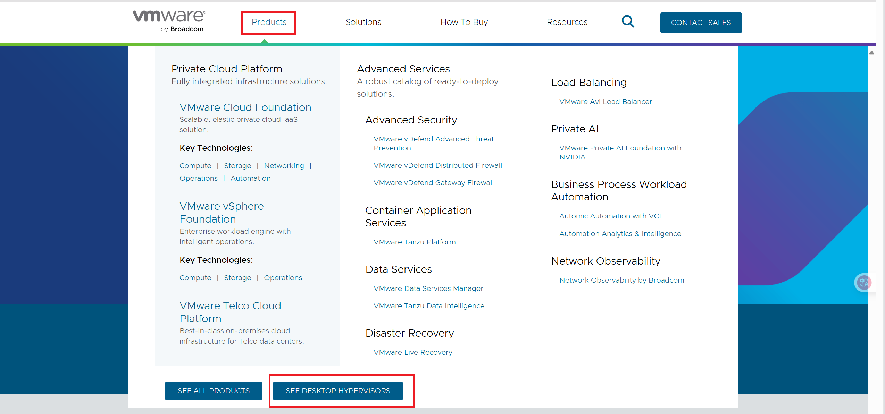
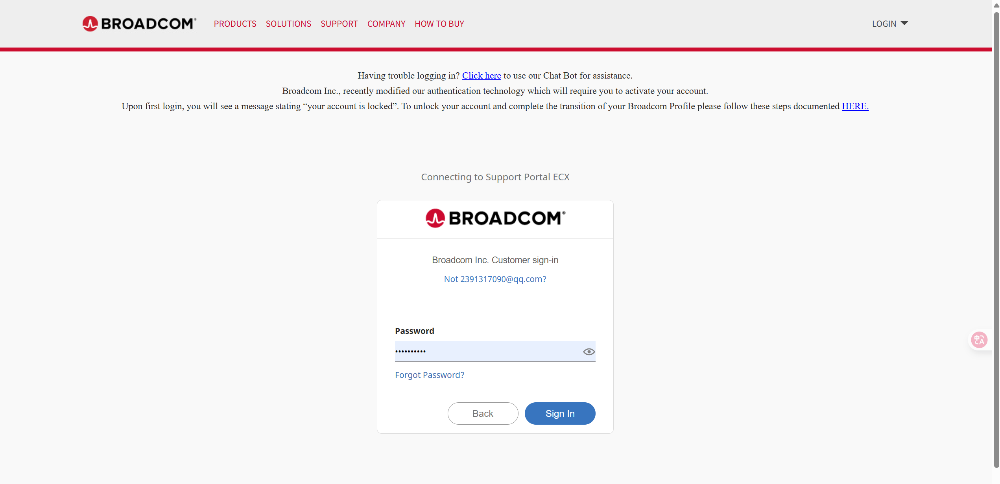
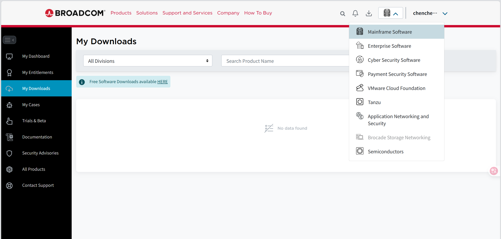
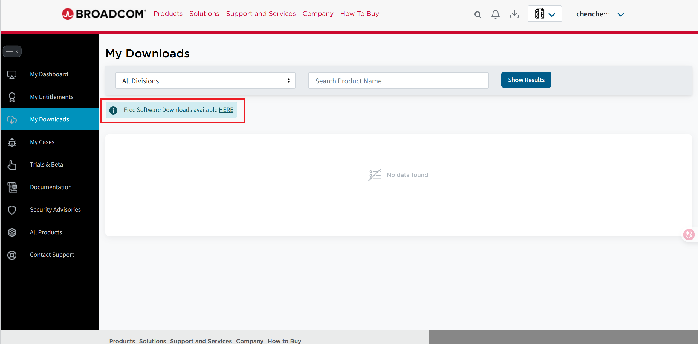
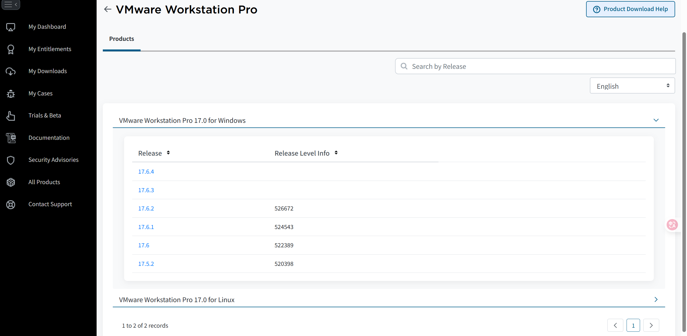
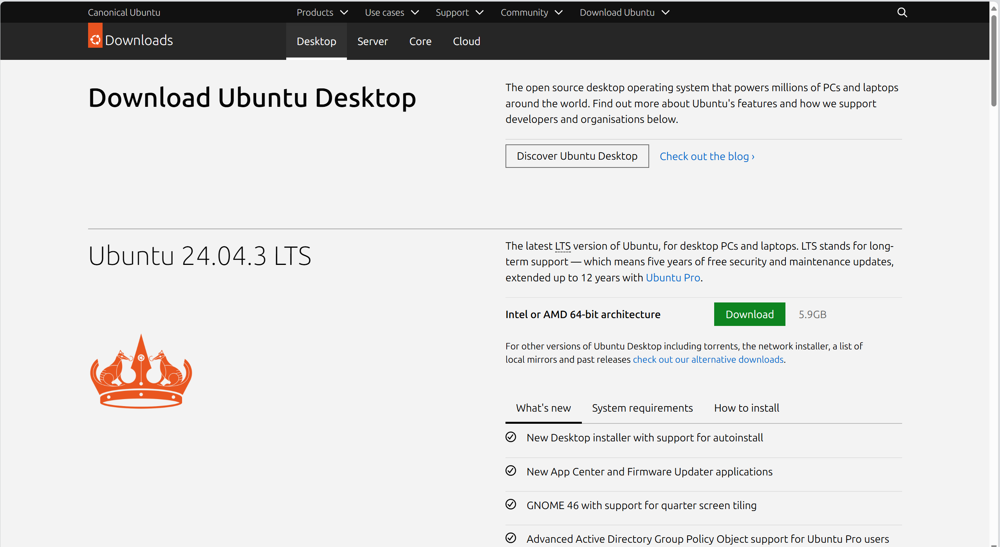
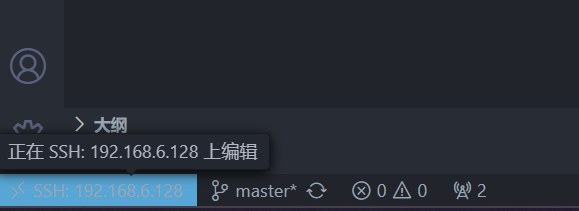
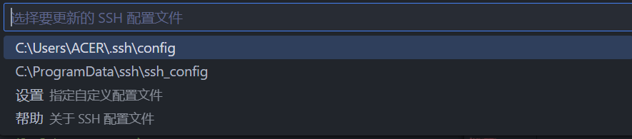
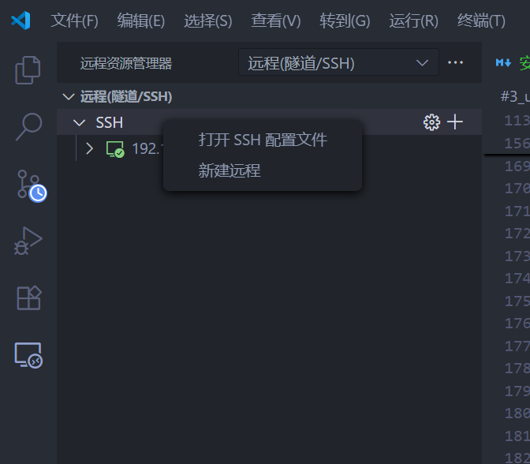

### [我的github库](https://github.com/syntheticfeather/JoTang2025)

# 第一部分：使用 VMware 安装 Ubuntu 虚拟机流程

## 准备工作：

### 下载 VMware 软件：

找VMware的安装可真是折磨人  
我参考了这篇CSDN文章:  
[https://blog.csdn.net/air__j/article/details/142798842](https://blog.csdn.net/air__j/article/details/142798842)  
并做了一些调整

- ## 打开VMWare的官网 https://www.vmware.com/
    
- ## 点击上方的product选项并选择下面右侧的蓝色按钮
    
- ## 就会来到下载页面，但是还没完，甚至刚开始
    
- ## 点击download后我们回跳转到另一个网站，叫BROADCOM
    
- ## 正常登录后，中间应该是My Download，如果不是又在右上角点Mainframe跳转
    
- ## 点击free download的HERE链接
    
- ## 跳出的很多产品中下拉找到VMware Workstation Pro
    
- ## 然后你就到了版本分类的下载窗口了
    
- ## 选择你需要的版本。
      
    这里可能我登陆了很多次，左边的红框框应该有一个阅读并接受协议的选项，你需要勾选这个。  
    然后补全你的个人信息，你就可以下载VMware了

---
### 下载 Ubuntu 镜像文件（ISO文件）：

比较而言Ubuntu可就太有好了。

- ## 打开 Ubuntu 官方网站 https://ubuntu.com/download/desktop
    
    点击那个绿色的按钮，我们就完成了

- ## 然后我们会获得一个iso的文件，放在记得住的位置
    
    这是虚拟光盘，用于在VMware上创建虚拟机 

---
## 创建虚拟机
**创建和安装虚拟机**:

    打开 VMware 并创建新虚拟机：
    在 VMware 中点击“创建新的虚拟机”或“File” -> “New Virtual Machine”。
**选择配置类型**:

    选择: 典型（推荐），
    可以省下很多头发。

**安装来源**:

    选择“安装程序光盘映像文件（iso）”。
    点击“浏览”按钮，找到并选择你刚才下载的 Ubuntu 的 .iso 文件。
    注意:
    iso文件路径选好了，就不要移动iso文件了。不然会告诉你:

        无法连接虚拟设备 sata0:1，
        
        因为主机上没有相应的设备。

    而且是每次启动都会弹窗提示。(annoying *_*)

    这时候就去设置里面重新设置一下iso的路径即可

**简易安装信息**:

    如果你在上一步选择了 ISO 文件(如果没选那我也不知道了)。
    填写你的个人信息：
    上面个性化的命名没啥用，就是登陆时显示的名字。
    用户名： 你想要的登录用户名。
    密码： 设置登录密码。

**命名虚拟机**:

    给你的虚拟机起一个名字（如 My Ubuntu VM），并选择它的保存位置。建议放在一个剩余空间较大的硬盘上。

**指定磁盘容量**:

    是一个还是多个文件，我也不知道有什么区别，提示了我多个文件存储可能影响性能所以我选择了单个文件
    :)

**自定义硬件**:

    他给的配置挺好。
    其中有几个选项:
    网络适配器： 通常默认的“NAT”模式，它让虚拟机共享主机的网络连接，可以上网。
    检查并确保 CD/DVD (SATA) 设备已连接到你的 Ubuntu ISO 文件(如果没连上的话建议重复以上操作)。

**安装完成**：

    当屏幕显示安装完成，并要求你重启时，点击“现在重启”。
    重启后，你会看到 Ubuntu 的登录界面。输入你之前设置的密码即可登录。

**我们就安装好了ubuntu了。**:

**安装 VMware Tools（重要）**：  

    登录系统后，你可能会发现虚拟机的屏幕不能自适应窗口大小、无法在主机和虚拟机之间复制粘贴文件、还掉帧。
    这就需要安装 VMware Tools（在最新版本中通常会自动提示安装，或者叫 Open-VM-Tools）。  

**如果没有就用以下命令安装**:  

`sudo apt-get install open-vm-tools`  

**它的作用是增强虚拟机的性能和体验，提供**:  

    自由拉伸的屏幕分辨率（自适应客户机）  
    主机和虚拟机之间共享文件夹  
    更好的显卡性能  
    共享剪贴板（可以在主机和虚拟机之间复制文字和文件）  

### 一句话:
### ***用起来才爽***

# 第二部分：关于ssh远端登录兼免密处理

vscode上进行ssh连接后。  
就可以在vscode上写linux系统上的文件，用linux的命令。

- ## 1、**linux虚拟机上**:
        终端中:

        下载openssh的服务端
        sudo apt install openssh-server

        启动ssh服务
        sudo service ssh start

        或者设置为自启动
        sudo systemctl enable ssh

- ## 2、**vscode上**
    - ## 下载ssh remote插件
    - ## 然后ssh连接
        - ### **左下角的蓝色按钮**
            
        - ### **选择Remote-ssh**
            
        - ### **添加新的ssh主机**
                
        **需要输入name@host**
        - ### **怎么找这两东西呢**  
            #### name:  
            打开你的ubuntu输入:  `ctrl + shift + t`  

                就有name@ubuntu的提示  
            #### host:  
            终端中再次输入:`ip addr`

                找到inet，但不是127.0.0.0.1，那个是本地的，不是远程的。
            
        - ### **config的设置默认选第一个**
            
        - ### **之后选择操作系统，输入密码就可登录**
---
## 免密登录:
我们会给客户端一个密钥，然后给服务端公钥，这样每次访问的时候客户端就可以用密钥进行连接，免去密码输入。
- ## windows上:
    **生成公密钥:**

    管理员模式打开powershell:

    `Add-WindowsCapability -Online -Name OpenSSH.Client~~~~0.0.1.0`

        下载openssh的客户端后
        配置环境path。

    cmd终端中生成密钥
    `ssh-keygen -t rsa`
        直接三下enter

    默认在C盘中的C:\Users\“用户名”\.ssh中。

        会有5个文件:
            id_rsa (称作密钥)
            id_rsa.pub (称作公钥)        
            (两个都要使用)
            ...

- ## linux上:
    终端命令行中:  

    `mkdir ~/.ssh`

        创建.shh目录

    `cd ~/.ssh`

        进入目录

    `touch authorized_keys`

        创建 authorized_keys 文件

        将id_rsa.pub文件内容复制到authorized_keys中

- ## 移植密钥也可以:
    就是在linux系统上生成公密钥，然后把密钥给windows系统。  
    不过AI告诉我这有点危险，并且给我提供了另一种生成指令  
    `ssh-keygen -t ed25519`  
    更安全更快速。  
    其他都是一样的。    

- ## vscode上:
        左侧菜单栏远程资源管理中，对登陆的远端机进行config设置
        加上一行:
            IdentityFile "C:\Users\"用户名"\.ssh\id_rsa" (也就是密钥地址)
        重启vscode，就可以免密登录了。
    
    

# 结语

    总体来说配置linux系统确实流程很长，不过反复的碰壁，终于成功了。  

    熟悉了一大堆linux的指令，环境配置更是轻车熟路。  

    查资料不对后自己探索出来还是很有成就感的。

    还了解了服务端和用户端的ssh的不同。

    wsl配置了一下，但是纯指令看着不太喜欢，就直接关掉Hyper-V采用VMware虚拟机。

